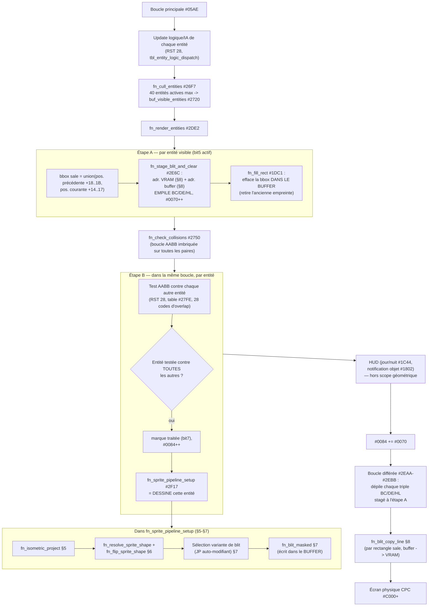

# Le pipeline de rendu isométrique — algorithme complet

Document de référence autonome, écrit pour servir de base à une future
réécriture du moteur de rendu dans un autre langage. Contrairement à
`docs/SESSION_SUMMARY.md` (journal chronologique des découvertes) ou
`docs/SYMBOLS.md` (table de symboles adresse par adresse), ce document
décrit **l'algorithme lui-même**, indépendamment de l'implémentation
Z80/CPC — ce qu'il calcule, pourquoi, et dans quel ordre.

Statut global : le squelette complet est **confirmé** par désassemblage
direct + vérification live (dump/diff mémoire, tests comportementaux).
Quelques détails mineurs restent `hypothesis` ou ouverts — signalés
explicitement en section 9.

Sources : `docs/SYMBOLS.md` (entrées `0x2DE2`, `0x2750`, `0x2F02`,
`0x2F17`, `0x2F8D`, `0x31E9`, `0x0829`, `0x2EDC`, `0x3186`, `0x3195`,
`0x2EC0`), `docs/MEMORY_MAP.md`, `notes/2026-08-06-rendering-engine.md`,
`notes/2026-08-06-memory-zones-model.md`,
`notes/2026-08-09-zone-8000-9000-gap.md`. Pour l'annexe §11 (structures
de salle) : `docs/SYMBOLS.md` (entrées `0x2C3A`, `0x1DFB`, `0x2B8D`,
`0x2BF9`, `0x33DD`, `0x33D4`, `0x3E6E`, `0x3D5D`, `0x417E`, `0x0147`),
`notes/2026-08-06-room-navigation.md` (désassemblage annoté détaillé de
`fn_load_room_data`/`fn_instantiate_room_objects`/`fn_room_transition`/
`fn_resolve_neighbor_room`).

---

## 1. Vue d'ensemble : pourquoi une architecture à deux étages

Le jeu est un portage ZX Spectrum → CPC. Le moteur de rendu isométrique
d'origine (Spectrum, écran bitmap linéaire) n'a pas été réécrit pour le
matériel CPC (VRAM entrelacée, largeur de ligne différente) : il dessine
toujours dans un **buffer intermédiaire linéaire** avec sa propre
orientation et largeur de ligne, et une routine de copie finale
spécifique au CPC convertit ce buffer vers la VRAM réelle à chaque
frame. C'est la clé pour comprendre toute la suite : **deux systèmes de
coordonnées coexistent**, et une seule routine (`fn_blit_copy_line`,
section 8) fait le pont entre eux.

```
Coordonnées grille (monde 3D isométrique)
        │  fn_isometric_project (§5)
        ▼
Coordonnées "buffer intermédiaire" (linéaire, 64 octets/ligne, axe Y
inversé par rapport à l'écran final)
        │  fn_blit_copy_line (§8) : flip Y + entrelacement CRTC
        ▼
Coordonnées VRAM CPC réelles (0xC000+, 80 octets/ligne, entrelacée)
```

## 2. Zones mémoire impliquées

| Zone | Rôle dans le rendu |
|---|---|
| `#0000-#3FFF` (CODE) | Toutes les routines décrites ici |
| `#417E-#429D` (RESSOURCES) | `tbl_object_catalog` — catalogue d'objets (hors du calcul géométrique lui-même) |
| `#429E`+ (RESSOURCES) | `tbl_sprite_dispatch` — table de pointeurs word vers les données de forme des sprites, indexée par type d'entité |
| `#8010-#8100` | Pile Z80 active (SP init `#8100`) — profondeur atteinte pendant le rendu (jusqu'à 40 entités × 3 mots empilés, voir §4) |
| `#8200-#8FFF` (14 tables de 256 octets) | Tables masque/couleur du blit masqué, voir §7 |
| `#8100` | Table calculée au boot, rôle non tracé (voir §9) |
| `#9000-#BFFF` | **Buffer intermédiaire de pré-rendu** : 64 octets/ligne, axe Y inversé, image complète de la salle + entités avant conversion CPC |
| `#C000-#FFFF` | VRAM CPC réelle (Mode 1, 80 octets/ligne, entrelacée, confirmée via CRTC R12/R13) |

## 3. Structure d'une entité (champs utilisés par le rendu)

28 octets/entité, tableau actif de 40 entités à `#00D7`. Champs
pertinents pour le rendu (voir `include/entity_struct.equ.asm` pour la
liste complète) :

| Offset | Nom | Rôle |
|---|---|---|
| `+00` | `type` | ID d'entité — indexe `tbl_sprite_dispatch` (forme) ET `tbl_entity_logic_dispatch` (IA) |
| `+01` | `grid_x` | Coordonnée de grille, axe 1 |
| `+02` | `grid_y` | Coordonnée de grille, axe 2 |
| `+03` | `grid_z_or_offset` | Offset additif (hauteur / 2e axe projeté) |
| `+07` | `flags` | bit4 = "à retraiter", bit5 = "en cours de traitement", bit6 = orientation courante |
| `+12` | `proj_offset_x` | Calibration de projection, axe 1 |
| `+13` | `proj_offset_y` | Calibration de projection, axe 2 |
| `+14` | `screen_w` | Largeur bbox écran courante (= largeur sprite + 1, voir §6) |
| `+15` | `screen_h` | Hauteur bbox écran courante |
| `+16` | `screen_x` | Position écran projetée courante (sortie de §5) |
| `+17` | `screen_y` | Position écran projetée courante (sortie de §5) |
| `+18..1B` | `*_prev` | Copie de `+14..17` de la frame précédente (nécessaire pour effacer l'ancienne position, voir §4) |

## 4. Le pipeline par frame — vue d'ensemble



**Point contre-intuitif à retenir pour une réécriture** : la détection
de collision et le dessin ne sont **pas deux passes séparées**. Le jeu
original les imbrique dans la même boucle (`fn_check_collisions` déclenche
elle-même le dessin de chaque entité dès que son test de collision est
terminé) — probablement une économie de code/temps sur Z80 (un seul
parcours de la liste au lieu de deux), mais **rien n'empêche une
réécriture de séparer proprement les deux responsabilités** (collision
d'un côté, rendu de l'autre) : l'algorithme géométrique lui-même (§5-§8)
ne dépend pas de cet entrelacement.

## 5. Projection isométrique — la formule

**Confirmé numériquement** (calcul exact vérifié + test comportemental :
modifier `grid_x` en direct déplace le sprite en diagonale à l'écran,
signature d'une vraie projection isométrique, pas d'un simple décalage).

```
entrée  : grid_x, grid_y (coordonnées de grille)
          grid_z_or_offset (offset additif, ex. hauteur)
          proj_offset_x, proj_offset_y (constantes de calibration par entité)

screen_x = grid_x + grid_y - 0x80 + proj_offset_x
screen_y = (grid_y - grid_x + 0x80) / 2 + grid_z_or_offset - 0x68 + proj_offset_y

sortie  : carry SET si screen_y < 0xC0  (=> entité visible/dans le champ)
          carry CLEAR                   (=> hors champ, l'entité n'est PAS dessinée)
```

### Conventions d'axe — À LIRE AVANT TOUTE RÉIMPLÉMENTATION

Les coefficients ci-dessus ne suffisent pas : deux conventions implicites les
accompagnent. Elles valent pour une réimplémentation partant **de zéro**.

⚠️ **Ne pas s'en servir pour « corriger » le portage `web/` existant** : celui-ci
travaille délibérément dans l'espace MIROIR de ces conventions (+Y vers le
haut, ancre bas-gauche), parce que les PNG produits par `tools/sprite_dump.py`
sont eux-mêmes des images miroir du rendu réel. Les deux miroirs se composent
en une image correcte, et en retourner une seule moitié casse tout — une
session entière y est passée le 2026-08-15. Voir `docs/METHODOLOGY.md` §20.

1. **`screen_y` croît vers le BAS** (origine en haut à gauche de l'écran).
   Preuve : le test de culling compare `screen_y` à `0xC0`, une hauteur
   d'écran.
2. **`screen_y` est la ligne du HAUT du sprite**, qui s'étend ensuite vers le
   bas. Preuve : `screen_h` est ajusté si `screen_y + screen_h > 0xC0` (§7).
3. **`screen_x` est la colonne de GAUCHE du sprite.** Preuve indépendante :
   `proj_offset_x` vaut exactement `-largeur/2` pour tous les types centrés
   sur leur case (bloc `0x07` : -16 pour 32 px de large ; mur `0x0A` : -20
   pour 40 ; `0x0B`/`0x16`/`0x1E` : -12 pour 24). La coordonnée projetée est
   donc le **coin haut-gauche**, jamais un centre ni un point d'appui au sol.

Conséquence pratique : `grid_z_or_offset` s'AJOUTE à `screen_y` (`add a,(ix+
off_grid_z_or_offset)`, pas de négation) — une valeur plus grande descend
donc à l'écran. Le champ est bien un décalage écran, pas une altitude, d'où
son nom.

C'est la projection isométrique classique `(x+y, (y-x)/2)` (axonométrie
à 2:1), décalée par des constantes de calibration propres à chaque
entité/sprite (`proj_offset_x/y`) et un test de culling vertical simple
(un seul seuil, pas de test d'intervalle complet — cohérent avec un
moteur qui ne gère qu'un culling grossier, laissant le travail fin au
clipping du blit lui-même, voir §7).

Exemple vérifié (entité joueur) : `grid_x=0x6E, grid_y=0x80,
proj_offset_x=0xF4, proj_offset_y=0xF9` → `screen_x=0x62, screen_y=0x5A`
(valeurs observées en RAM, calcul exact).

## 6. Résolution de la forme du sprite + retournement

```
pointeur_forme = tbl_sprite_dispatch[type * 2]      (word, table à #429E)
octet0 = pointeur_forme[0]

si octet0 == 0:
    abandon complet du rendu de cette entité (rien à dessiner)
sinon:
    appelle TOUJOURS la routine de retournement (fn_flip_sprite_shape) —
    c'est ELLE qui décide, en interne, si un retournement a réellement
    lieu :
        si bit7(octet0) != bit6/7(flags de l'entité, orientation courante) :
            bit7(octet0) ^= 1                     (bascule le flag stocké)
            ÉCHANGE PHYSIQUEMENT les octets de la ligne de forme
            (miroir horizontal, EN PLACE — pas de copie dans un buffer
            séparé)
        sinon :
            ne fait rien (déjà dans la bonne orientation)
```

**Point important pour une réécriture** : le retournement mute les
données de forme **en place**. Dans le jeu original, cela n'est
possible que si chaque instance d'entité utilisant une forme donnée a
sa **propre copie mutable** des données de forme (sinon deux entités du
même type avec des orientations opposées se corrompraient mutuellement
— hypothèse forte, pas encore vérifiée directement, voir §9). Une
réécriture moderne devrait très probablement **stocker l'orientation à
part et retourner à la lecture** (au moment du blit) plutôt que de
muter des données partagées — plus sûr et strictement équivalent en
sortie.

Après résolution de la forme, deux octets supplémentaires sont lus dans
les données de forme et écrits dans la structure entité :
- `screen_w = (octet_suivant & 0x3F) + 1` (largeur, en "colonnes" de
  blit — voir §7 pour ce que représente une colonne)
- `screen_h` = un octet suivant, ajusté si `screen_y + screen_h > 0xC0`
  (clipping vertical bas, recalcule `screen_h` pour ne pas dépasser)

## 7. Sélection dynamique de la variante de blit — le point le plus subtil de tout le pipeline

Le CPC (comme le Spectrum) n'a pas d'instruction de blit matériel : le
jeu doit lire chaque octet de la forme du sprite et le combiner avec
l'écran via masque+couleur. Le problème : un sprite peut être positionné
à **n'importe quelle position horizontale en pixels**, alors que la
mémoire s'adresse par octet (plusieurs pixels/octet). Le moteur résout
ça avec **deux mécanismes combinés** :

### 7.1 Deux familles de boucles de blit, sélectionnées par un `JP` auto-modifiant

```
alignement = screen_x & 3        (0..3, position sub-octet du sprite)

si alignement == 0:
    famille = "alignée"   (1 octet écran lu/écrit par octet de forme,
                            unité de boucle = 10 octets machine)
    décalage_table = 2
sinon:
    famille = "décalée"   (2 octets écran adjacents lus/écrits par octet
                            de forme — le pixel "dépasse" sur l'octet
                            suivant, unité de boucle = 18 octets machine)
    décalage_table = alignement * 4     (= 4, 8 ou 12)

point_entrée = base(famille) + (largeur_du_sprite × taille_unité(famille))
PATCHE l'opérande d'un unique JP (auto-modifiant) pour saute directement
à `point_entrée`
```

Concrètement, la routine de blit (`fn_blit_masked`) contient en mémoire
**une série d'entrées consécutives, une par largeur possible**, pour
chacune des deux familles. Plutôt que de tester la largeur avec un
`switch`/branchement classique, le jeu **calcule l'adresse exacte** de
l'entrée voulue et réécrit l'opérande d'un `JP` juste avant d'y sauter —
une technique de dispatch par calcul direct d'adresse, économe en cycles
sur Z80 mais qui n'a **aucune raison d'être reproduite** dans une
réécriture moderne : un simple `switch`/table de fonctions par
(famille, largeur) est strictement équivalent et plus lisible.

### 7.2 Les tables masque/couleur (`#8200-#8FFF`)

**Rôle confirmé par désassemblage direct** (pas une hypothèse — trouvé
en traçant le code, comme convenu). `decalage_table` (calculé en 7.1)
détermine une page mémoire `H = 0x80 + decalage_table`, utilisée comme
base d'une table indexée par l'octet de forme lu :

```
octet_forme = shape[i]                       (colonne i du sprite)
écran_actuel = screen[dest]

masque1  = table[H][octet_forme]             (H = 0x82, 0x84, 0x88 ou 0x8C)
couleur1 = table[H+1][octet_forme]
écran_actuel = (écran_actuel AND masque1) OR couleur1
screen[dest] = écran_actuel

si famille == "décalée":                      (le pixel dépasse sur l'octet suivant)
    masque2  = table[H+2][octet_forme]
    couleur2 = table[H+3][octet_forme]
    screen[dest+1] = (screen[dest+1] AND masque2) OR couleur2
```

- Famille "alignée" : `H=0x82` → une seule paire masque/couleur
  (`#8200`/`#8300`, les tables "brutes", non retravaillées).
- Famille "décalée", décalage 1/2/3 pixels : `H=0x84/0x88/0x8C` → un
  triplet **masque1/couleur1/masque2/couleur2** par décalage (4 tables
  contiguës par décalage, construites au boot par
  `fn_build_pixel_bitscatter_tables`, voir §9).

Ces 14 tables de 256 octets (`#8200-#8FFF`) sont donc l'équivalent d'un
**LUT (lookup table) pixel→bits-écran** précalculé pour le format
graphique CPC — la technique classique pour éviter de recalculer, pixel
par pixel, l'éparpillement de bits propre à l'encodage graphique CPC.
**Pour une réécriture** : ce détail est spécifique au format mémoire
CPC (bits de couleur non contigus dans un octet) et **ne doit pas être
reproduit tel quel** — un renderer moderne (framebuffer RGBA classique)
n'a pas cette contrainte ; un pixel du sprite se traduit directement en
un pixel destination, sans passer par un masque/couleur bit à bit.
Cette section documente donc surtout **pourquoi** le code original est
si indirect, pour ne pas chercher à "porter" cette indirection sans
raison.

## 8. Adressage écran/buffer et copie finale

### 8.1 Conversion coordonnées → adresse

Deux routines convertissent des coordonnées (colonne, ligne) en adresse
mémoire complète :

- **`fn_screen_addr_from_bc` (`#3195`)** : `(ligne, colonne)` →
  adresse VRAM CPC complète. Utilise une table de 24 entrées word à
  `#31B9` (progression exacte par pas de `0x50`=80, largeur de ligne
  Mode 1 CPC) pour le composant ligne, et un calcul direct
  (`colonne>>2 + 8`) pour le composant colonne.
- **`fn_buffer_addr_from_vram` (`#3186`)** : convertit une adresse VRAM
  en adresse dans le buffer intermédiaire — `adresse_buffer =
  (adresse_vram >> 2) + 0x9000`. Réutilisée aussi par le moteur de texte
  du menu (routine générique, pas de sens métier fixe).

### 8.2 Copie différée buffer → VRAM (flip Y + entrelacement CRTC)

Chaque rectangle "sale" (bbox union ancienne/nouvelle position, voir
§4 étape A) a été stagé sur la pile (BC=dimensions, DE=dest VRAM,
HL=source buffer) pendant le rendu de l'entité correspondante. Une fois
TOUTES les entités dessinées dans le buffer intermédiaire, une boucle
différée dépile chacun de ces triples et appelle `fn_blit_copy_line`
(`#2EC0`) :

```
pour chaque ligne (B fois) :
    LDIR  C octets   (copie source(buffer) -> dest(VRAM))
    dest += 0x0800                          (saut standard entrelacement CRTC)
    si dépassement : dest += 0xC050          (correction fin de bande, tous les 8 lignes)
    source -= 64                            (largeur du buffer intermédiaire —
                                              SOURCE PARCOURUE DE LA FIN VERS LE DÉBUT)
```

**`source -= 64` est le flip Y** : le buffer intermédiaire a l'axe Y
inversé par rapport à l'écran final (héritage du moteur Spectrum
original, écran linéaire, jamais adapté). C'est cette seule routine qui
gère la conversion vers le format CPC (entrelacement + flip). **Pour
une réécriture** : si le framebuffer cible est déjà dans l'orientation
"normale" souhaitée, ce flip Y et cet entrelacement n'ont plus de raison
d'exister — ils sont uniquement des artefacts du portage CPC↔Spectrum.

## 9. Statut, limites connues, pistes ouvertes

- **`#8100`** (1 des 15 tables construites au boot, motif nibble
  dupliqué `00,11,22,...,FF`) : **rôle non tracé**. Aucune instruction
  rencontrée jusqu'ici ne la référence. Ne pas spéculer sur son usage
  tant qu'aucun code ne la lit (règle établie en session).
- **Format exact des données de forme au-delà des 2 premiers octets**
  (orientation+largeur, largeur+hauteur) : le contenu réel des colonnes
  de pixels (`tbl_sprite_dispatch`, données au-delà de `#429E`) n'a
  jamais été décodé/transcrit — seule sa consommation octet par octet
  par le blit est confirmée, pas sa structure interne complète (nombre
  exact d'octets par forme, encodage couleur par octet, etc.).
- **Mutation en place des données de forme** (§6) : l'hypothèse "chaque
  entité a sa propre copie" n'a pas été vérifiée directement (ex. par
  deux entités du même type visibles simultanément avec des orientations
  opposées, à observer en jeu).
- **`fn_hud_day_night_cycle` (`#1C44`)** et **`fn_hud_slot_notification`
  (`#1802`)** : appelées dans le pipeline (voir §4) mais hors du calcul
  géométrique — non détaillées ici volontairement (portée HUD, pas
  rendu de scène).
- **`fn_collision_effect` (`#2876`)** et la logique de réaction aux
  collisions : hors scope de ce document (rendu uniquement) — voir
  `docs/SYMBOLS.md` pour le détail collision.
- **Test de culling** (§5, `carry` sur `screen_y < 0xC0`) : un seul
  seuil vérifié, pas de test d'intervalle horizontal — à confirmer si
  un test similaire existe pour `screen_x` (pas trouvé jusqu'ici, le
  clipping horizontal semble se faire implicitement via le blit
  lui-même plutôt qu'un culling en amont).

## 10. Résumé algorithmique (pseudocode haut niveau, pour réécriture)

```
pour chaque frame:
    culler les entités actives -> liste des entités visibles (max 40)

    dirty_rects = []
    pour chaque entité visible marquée "à retraiter":
        rect = union(bbox_écran_précédente(entité), bbox_écran_courante(entité))
        effacer(buffer_intermédiaire, rect)
        dirty_rects.append(rect)
        entité.bbox_précédente = entité.bbox_courante   # préparation frame suivante

    pour chaque paire d'entités visibles:
        tester_collision_AABB(entité_a, entité_b)
        # dans le jeu original : dès qu'une entité a été testée contre
        # toutes les autres, elle est immédiatement dessinée. Une
        # réécriture peut séparer proprement : d'abord TOUTES les
        # collisions, PUIS TOUT le dessin — résultat identique.

    pour chaque entité visible:
        (screen_x, screen_y, visible) = projeter_isométrique(entité)
        si non visible: continuer
        forme = résoudre_forme(entité.type)
        si forme absente: continuer
        appliquer_retournement_si_besoin(forme, entité.orientation)
        dessiner_masqué(buffer_intermédiaire, forme, screen_x, screen_y)
        # dessiner_masqué : pour chaque colonne de la forme, combiner
        # avec l'écran via (fond AND masque) OR couleur — le calcul du
        # masque/couleur en fonction du pixel source et de l'alignement
        # horizontal est un détail d'implémentation CPC (§7.2), pas une
        # partie essentielle de l'algorithme à reproduire tel quel dans
        # un renderer moderne (là où un pixel source = un pixel dest.)

    pour chaque rect dans dirty_rects:
        copier(buffer_intermédiaire[rect], écran_réel[rect])
        # dans le jeu original ce blit fait aussi le flip Y + gère
        # l'entrelacement CPC (§8.2) — inutile si le framebuffer cible
        # est déjà dans l'orientation voulue
```

## 11. Annexe — Structures de salle (room list / room courante) et leur articulation avec les entités

Cette section complète le §3 (structure d'entité) : elle documente ce
qui **n'est pas** une entité mais définit le contexte "salle" dans
lequel les entités évoluent. Point structurant à retenir avant le
détail : **il n'existe pas de `struct Room` unique et contiguë** dans
le binaire. Le "contenu" d'une salle est réparti en trois pièces
distinctes, résolues/reconstruites au moment où le joueur y entre :

1. une **liste globale statique** (en zone RESSOURCES, jamais modifiée
   en jeu) qui associe à chaque numéro de salle une position de
   référence caméra et le graphe de connexions vers ses voisines ;
2. un **jeu de variables globales + une petite table locale
   reconstruite** représentant la "salle courante" ;
3. le **tableau d'entités actives lui-même** (`struct_entities_base`,
   §3), qui est la vraie représentation du contenu visible d'une salle
   (murs, gardiens, objets) — il n'y a pas de géométrie de salle séparée
   des entités qui la composent.

### 11.1 La liste des salles — table maître statique

Deux tables adjacentes en RESSOURCES, indexées par `room_number` (le
même octet que le champ `+0x08` de la structure d'entité, §3, quand il
désigne la salle courante) :

- **`tbl_room_master_index`** (`0x33DD`, **confirmed** sur le framing,
  hypothesis sur le détail du payload) : 128 entrées de taille
  **variable**, `[room_id][entry_len][payload...]`, couvrant exactement
  `0x33DD-0x3D5D`. Recherche linéaire : on avance de `entry_len` tant
  que `room_id` ne correspond pas à la salle demandée (`fn_load_room_data`,
  `0x2C3A`).
- **`tbl_room_master_coords`** (`0x33D4`, hypothesis partiellement
  invalidée) : seulement **3 entrées de 3 octets** — donc PAS une
  coordonnée par salle individuelle, plutôt un petit jeu de "zones/secteurs"
  partagées par plusieurs salles, sélectionné par un champ 3 bits extrait
  du payload ci-dessus.
- **`tbl_room_index_ptrs`** (`0x3E6E`, confirmed) : table de pointeurs
  word, indexée DIRECTEMENT par chaque octet non-`0xFF` du payload —
  chemin par défaut.
- **`tbl_room_connection_ptrs`** (`0x3D5D`, hypothesis) : chemin
  alternatif, déclenché par un octet `0xFF` dans le payload (moins
  fréquent, détail du contenu pointé non tracé).

### 11.2 La salle courante — variables globales + table de connexions reconstruite

Au chargement d'une salle (`fn_load_room_data` `0x2C3A`, appelée depuis
`fn_init_room` `0x2A68`) :

- les 3 octets de l'entrée `tbl_room_master_coords` trouvée sont copiés
  dans **`var_camera_reference`** (`0x0071`), **`var_camera_reference_y`**
  (`0x0072`) et **`var_room_data_field_2`** (`0x0074`) — position de
  référence caméra, utilisée par `fn_player_in_view_bounds` (`0x2122`)
  et `fn_room_transition` (`0x2B8D`, voir §11.3) ;
- le champ 3 bits est copié dans **`var_sparkle_and_jingle_phase`**
  (`0x0073`, variable à double rôle, voir `docs/SYMBOLS.md`) ;
- la **table de connexions locale** `tbl_room_connections` (`0x0147`) est
  effacée puis repeuplée depuis le reste du payload, via
  `tbl_room_index_ptrs`/`tbl_room_connection_ptrs`.

**Détail confirmé par désassemblage direct de `fn_resolve_neighbor_room`
(`0x2BF9`)** : `tbl_room_connections` a un pas de **56 octets** (`0x38`)
par entrée, jusqu'à **4 entrées**. Seuls les 4 premiers octets de chaque
entrée sont tracés :

```
+0x00  marqueur de validité   (entrée invalide si >= 6 → fin de table)
+0x01  code_direction_lo      (additionné à +0x02, comparé au code fixe
                                de la direction testée)
+0x02  code_direction_hi
+0x03  neighbor_room          (copié dans (ix+03) du joueur lors de la
                                transition effective, voir §11.3)
```

Les codes de direction fixes, utilisés par `fn_room_transition`
(`0x2B8D`) pour chercher dans cette table selon le bord de grille franchi
par le joueur (`grid_x`/`grid_y` == `0x00` ou `0xFF`) :

| Bord franchi | Code direction |
|---|---|
| `grid_y == 0xFF` (bas) | `0xC8` |
| `grid_y == 0x00` (haut) | `0x51` |
| `grid_x == 0xFF` (droite) | `0xAE` |
| `grid_x == 0x00` (gauche) | `0x37` |

**Point notable, économie mémoire délibérée** : `0x0147` correspond
exactement à `struct_entities_base + 4×28` — c'est-à-dire le **4e slot**
du tableau d'entités actives (§3). Cette table de connexions **partage
sa mémoire** avec les slots d'entités inutilisés : la salle n'a jamais
plus de 2 objets catalogués instanciés (slots 2 et 3, `0x010F`/`0x012B`,
voir §11.4), donc les slots 4 à 11 (4 connexions × 56 octets = 8 slots
de 28 octets) sont réutilisés comme stockage temporaire pour cette table
tant qu'ils ne sont pas nécessaires pour de vraies entités de la salle.
**Écart non résolu** : `docs/SYMBOLS.md` (entrée `0x3E6E`) documente une
entrée source de 8 octets copiée depuis `tbl_room_index_ptrs`, à
réconcilier avec le pas de 56 octets observé côté destination — probablement
un petit en-tête significatif suivi de remplissage résiduel issu du
nettoyage par blocs de 28 octets fait avant repeuplement (`0x2C54`), mais
non vérifié octet par octet.

### 11.3 Transition entre salles (consommation de la table de connexions)

`fn_room_transition` (`0x2B8D`, **confirmed**) : à chaque frame, si le
joueur atteint un bord de grille, résout le code de direction
correspondant, appelle `fn_resolve_neighbor_room` (`0x2BF9`) qui
parcourt `tbl_room_connections` par pas de 56 octets et retourne
`neighbor_room` (`+0x03`) si le code de direction correspond. Le joueur
est alors repositionné symétriquement de l'autre côté de la nouvelle
salle (`0x80 - coordonnée`, ajustée par `bbox_w`/`bbox_h`, §3) et
`(ix+03)` (`grid_z_or_offset` du joueur — réutilisé ici comme registre
"nouveau numéro de salle" pendant la transition, rôle distinct de son
rôle habituel de hauteur) reçoit `neighbor_room`.

### 11.4 Catalogue statique d'objets par salle

**`tbl_object_catalog`** (`0x417E`, **confirmed**, format ET contenu) :
32 entrées de 9 octets, `0x417E-0x429E` exactement — adjacente par
construction à `tbl_sprite_dispatch` (§6), qui commence juste après.
`fn_instantiate_room_objects` (`0x1DFB`) scanne cette table et instancie,
dans les slots d'entité 2 et 3 (`0x010F`/`0x012B`, juste après les
templates joueur/compagnon), chaque entrée dont le champ `room` de
travail correspond à la salle courante — au plus 2 objets par salle.

### 11.5 Articulation avec le tableau d'entités (§3) — résumé

```
struct_entities_base (0x00D7)
  slot 0        : joueur           (template fixe, copié à l'init)
  slot 1        : compagnon        (template fixe, copié à l'init)
  slot 2, 3     : objets catalogués de la salle courante (§11.4)
  slot 4..11    : RÉUTILISÉS comme tbl_room_connections (§11.2) pendant
                  le chargement, PUIS redisponibles comme slots d'entité
                  normaux une fois la table consommée
  slot 12..39   : entités "fixes" de la salle (murs, gardiens, pièges…),
                  pré-remplies par les données de niveau au chargement
                  (mécanisme de remplissage exact non tracé dans ce doc,
                  hors scope rendu)
```

Autrement dit : une salle n'a pas de géométrie propre distincte des
entités — les murs, portes, blocs et pièges d'une salle sont eux-mêmes
des entités ordinaires (types `0x02`/`0x03`, `0x80`, etc., voir
`docs/SYMBOLS.md` §"types d'entité") placées dans le même tableau que le
joueur. "Charger une salle" consiste donc à : (1) résoudre sa position de
référence caméra + ses connexions (§11.1-§11.2), (2) instancier ses
objets catalogués (§11.4), (3) peupler le reste du tableau d'entités
avec son contenu fixe — le pipeline de rendu (§3-§10) ne voit ensuite
qu'un tableau d'entités comme un autre, sans notion de "salle" à ce
niveau.

### 11.6 Définitions C (annexe)

```c
#include <stdint.h>

/* ===================================================================
 * 1) LISTE DES SALLES — table maître statique (RESSOURCES, jamais
 *    modifiée en jeu). Indexée par room_number (même valeur que le
 *    champ +0x08 de struct_entity, §3, quand il désigne la salle
 *    courante).
 * =================================================================== */

/* tbl_room_master_index @0x33DD : 128 entrées de taille VARIABLE,
 * couvre exactement 0x33DD-0x3D5D. confirmed (framing), hypothesis
 * (détail du payload). */
typedef struct {
    uint8_t room_id;        /* +0x00 : clé de recherche */
    uint8_t entry_len;       /* +0x01 : longueur totale de l'entrée,
                                 utilisée pour avancer au suivant si
                                 room_id ne correspond pas */
    uint8_t payload[];       /* +0x02.. : field_byte (3 bits utiles ->
                                 var_sparkle_and_jingle_phase) puis une
                                 liste d'octets (longueur déduite de
                                 entry_len) :
                                   - octet != 0xFF : index DIRECT dans
                                     tbl_room_index_ptrs (chemin par
                                     défaut)
                                   - octet == 0xFF : chemin alternatif
                                     via tbl_room_connection_ptrs */
} room_master_index_entry_t;

/* tbl_room_master_coords @0x33D4 : SEULEMENT 3 entrées de 3 octets
 * (pas une par salle) — indexées ×3 par le champ 3 bits du payload
 * ci-dessus. hypothesis partiellement invalidée sur le rôle exact. */
typedef struct {
    uint8_t camera_ref_x;    /* -> var_camera_reference   (0x0071) */
    uint8_t camera_ref_y;    /* -> var_camera_reference_y (0x0072) */
    uint8_t field3;          /* -> var_room_data_field_2  (0x0074),
                                 rôle variable selon la salle (ex: borne
                                 haute d'une grille mobile, room 0x3F) */
} room_master_coords_entry_t;

/* tbl_room_index_ptrs @0x3E6E : pointeurs word, indexés DIRECTEMENT
 * par un octet non-0xFF du payload (chemin par défaut). confirmed. */
typedef uint16_t room_index_ptr_t;

/* tbl_room_connection_ptrs @0x3D5D : chemin alternatif (octet 0xFF
 * dans le payload). hypothesis, contenu pointé non tracé. */
typedef uint16_t room_connection_ptr_t;

/* ===================================================================
 * 2) SALLE COURANTE — variables globales (PAS une struct contiguë en
 *    mémoire réelle, simples adresses zero-page-like indépendantes ;
 *    regroupées ici comme vue logique pour une réécriture) + une
 *    table de connexions locale reconstruite à chaque chargement.
 * =================================================================== */

typedef struct {
    uint8_t camera_reference_x;    /* var_camera_reference        @0x0071 */
    uint8_t camera_reference_y;    /* var_camera_reference_y      @0x0072 */
    uint8_t sparkle_jingle_phase;  /* var_sparkle_and_jingle_phase @0x0073
                                       (double rôle, partagé avec l'anim.
                                       scintillement/jingle, voir SYMBOLS.md) */
    uint8_t room_data_field_2;     /* var_room_data_field_2       @0x0074 */
    uint8_t reset_flag_1;          /* var_room_reset_flag_1       @0x0075 */
    uint8_t reset_flag_2;          /* var_room_reset_flag_2       @0x0076 */
    uint8_t transition_flag;       /* var_room_transition_flag    @0x0078 */
} current_room_globals_t;   /* vue logique -- champs NON contigus en RAM réelle */

/* tbl_room_connections @0x0147 : table LOCALE reconstruite à chaque
 * fn_load_room_data (0x2C3A). PARTAGE SA MÉMOIRE avec les slots
 * d'entités 4..11 du tableau actif (0x0147 == struct_entities_base +
 * 4*28) -- réutilisation délibérée, voir §11.2/§11.5. confirmed sur le
 * pas de 56 octets et les 4 premiers octets (désassemblage direct de
 * fn_resolve_neighbor_room, 0x2BF9) ; le reste de l'entrée n'est pas
 * tracé octet par octet. */
typedef struct {
    uint8_t  valid_marker;    /* +0x00 : entrée invalide si >= 6 */
    uint8_t  dir_code_lo;     /* +0x01 : dir_code_lo + dir_code_hi ==
                                  code de direction fixe (voir enum) */
    uint8_t  dir_code_hi;     /* +0x02 */
    uint8_t  neighbor_room;   /* +0x03 : numéro de la salle voisine
                                  dans cette direction */
    uint8_t  reserved[0x38 - 4]; /* reste de l'entrée (56-4 octets),
                                     contenu exact non tracé */
} room_connection_entry_t;

#define ROOM_CONNECTIONS_MAX  4

/* Codes de direction fixes utilisés par fn_room_transition (0x2B8D) */
typedef enum {
    ROOM_DIR_UP    = 0x51,   /* sortie par grid_y == 0x00 */
    ROOM_DIR_DOWN  = 0xC8,   /* sortie par grid_y == 0xFF */
    ROOM_DIR_LEFT  = 0x37,   /* sortie par grid_x == 0x00 */
    ROOM_DIR_RIGHT = 0xAE,   /* sortie par grid_x == 0xFF */
} room_direction_t;

/* ===================================================================
 * 3) CATALOGUE STATIQUE D'OBJETS PAR SALLE
 * =================================================================== */

/* tbl_object_catalog @0x417E : 32 entrées de 9 octets, 0x417E-0x429E
 * EXACT (adjacente par construction à tbl_sprite_dispatch, §6).
 * confirmed (format ET contenu). */
typedef struct {
    uint8_t type;          /* +0x00 : type d'entité, réécrit chaque
                               partie par fn_catalog_randomize_types
                               (rotation pseudo-aléatoire 0x60-0x67) */
    uint8_t tpl_grid_x;     /* +0x01 : template FIXE, jamais modifié */
    uint8_t tpl_grid_y;     /* +0x02 */
    uint8_t tpl_grid_z;     /* +0x03 */
    uint8_t tpl_room;       /* +0x04 : salle d'appartenance (fixe) */
    uint8_t work_grid_x;    /* +0x05 : copie de travail, réécrite
                               depuis tpl_* à chaque partie */
    uint8_t work_grid_y;    /* +0x06 */
    uint8_t work_grid_z;    /* +0x07 */
    uint8_t work_room;      /* +0x08 : lue par fn_instantiate_room_objects
                               pour sélectionner les objets de la salle
                               courante */
} object_catalog_entry_t;

#define OBJECT_CATALOG_COUNT  32
```
