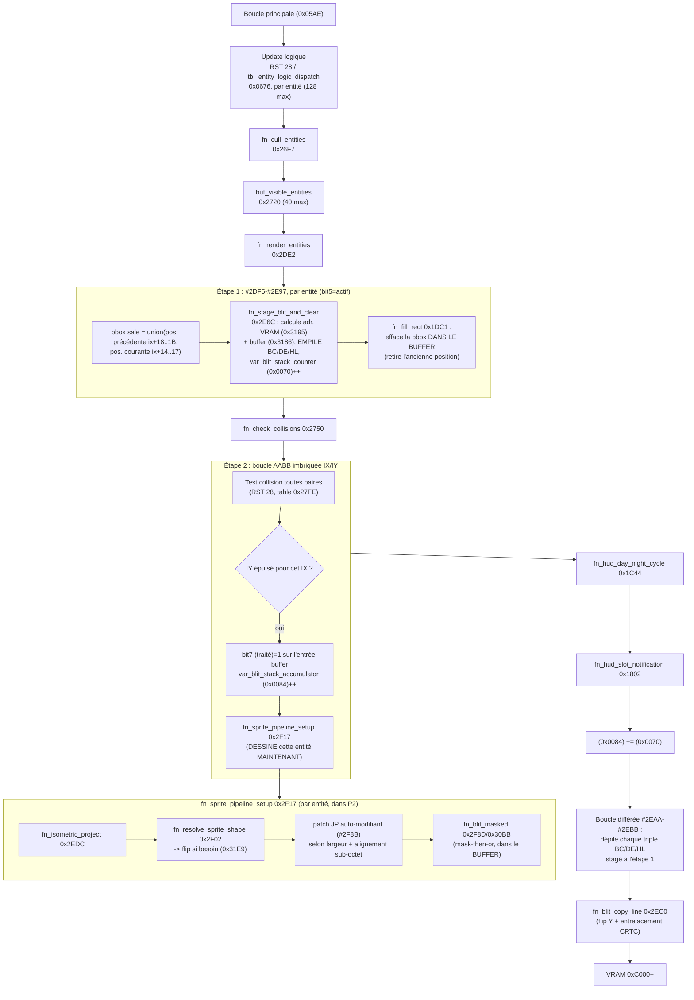
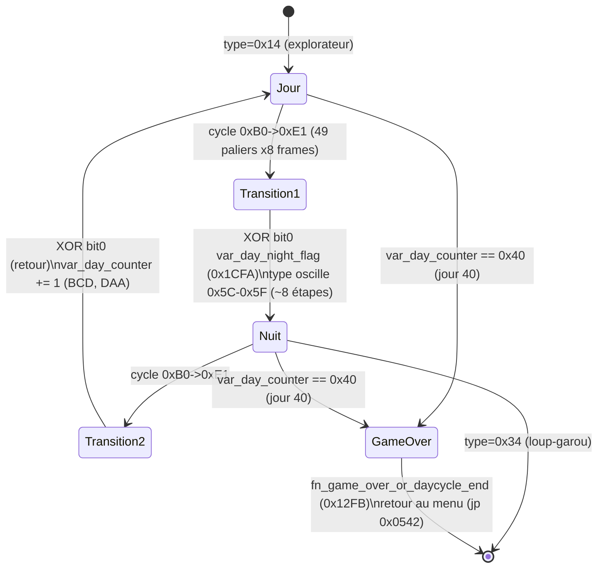
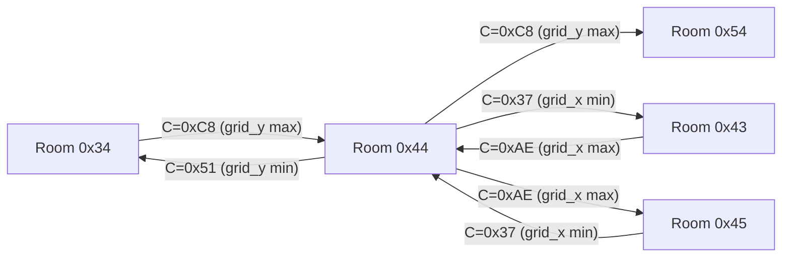

# Synthèse globale — Session du 2026-08-06

Vue d'ensemble de ce qui a été découvert sur Knight Lore (CPC), avec
diagrammes de principe. Référence détaillée : `docs/SYMBOLS.md` (table
de symboles), `docs/MEMORY_MAP.md` (mémoire, statuts), `docs/METHODOLOGY.md`
(techniques réutilisables), `docs/RENDERING_PIPELINE.md` (algorithme de
rendu isométrique complet, indépendant de l'implémentation Z80 — pensé
pour une future réécriture), `notes/2026-08-06-*.md` (détail par sujet).

## Continuité entre sessions Hermes

**Tout ce qui a été appris est sur disque, pas dans la conversation.**
Une nouvelle session Hermes qui commence par lire `docs/SYMBOLS.md`,
`docs/MEMORY_MAP.md` et `docs/METHODOLOGY.md` repart avec l'intégralité
des connaissances de cette session — `/clear` ou une nouvelle
conversation n'efface que l'historique de dialogue, pas le système de
fichiers. Le seul état volatile est celui de l'émulateur en mémoire
(breakpoints, patches temporaires) : à la fin de cette session, aucun
breakpoint n'est actif et le seul patch RAM tenté (neutraliser
`fn_check_collisions`) a été annulé et son annulation confirmée par
l'utilisateur — l'émulateur tourne dans un état propre. `/clear` ou une
nouvelle session est donc une bonne option pour repartir avec un
contexte de conversation plus léger, à condition de commencer la
nouvelle session en demandant de lire ces fichiers de référence.

---

## 1. Modèle mémoire global

```
0x0000 ─────────────────────────────────────────── 0x4000
 CODE (confirmé par codemap : seule zone exécutée)
   - Boucle principale de jeu (0x05AE+)
   - Toutes les routines fn_*

0x4000 ─────────────────────────────────────────── 0x8000
 RESSOURCES (jamais exécuté, uniquement lu)
   - tbl_object_catalog, tbl_sprite_dispatch
   - Données de forme de sprite
   - tbl_room_master_index / tbl_room_index_ptrs

0x8000 ─────────────────────────────────────────── 0xC000
 BUFFER INTERMÉDIAIRE (observation grossière, pas un bloc strict)
   - Largeur de ligne : 64 octets (confirmé par fn_blit_copy_line)
   - Axe Y INVERSÉ par rapport à l'écran final
   - Contient une image pré-rendue de la géométrie de la salle
     (reconnaissable visuellement dans une heatmap densité)

0xC000 ─────────────────────────────────────────── 0xFFFF
 VRAM (confirmé via CRTC R12/R13)
   - Orientation normale, entrelacement CPC standard (+0x0800/+0xC050)
```

## 2. Pipeline de rendu — vue d'ensemble par frame

**RÉVISÉ le 2026-08-09** : fn_render_entities n'exécute pas 2 passes
séparées (efface puis dessine) mais 3 étapes imbriquées, avec le dessin
effectif déclenché DEPUIS fn_check_collisions (pas avant/après elle).
Voir `docs/SYMBOLS.md` (entrées 0x2DE2, 0x2750, 0x2F17, 0x0084) pour le
détail complet.



## 3. Call graph détaillé (routines confirmées, principales)

```mermaid
flowchart TD
    MAIN["0x05AE Boucle principale"] --> UPD["RST 28 -> tbl_entity_logic_dispatch (0x0676)"]
    UPD --> PLAYER["fn_player_logic 0x20CB (type 0x12/0x14/0x34)"]
    PLAYER --> READINPUT["fn_read_input 0x28B7"]
    READINPUT --> READKB["fn_read_keyboard_line 0x0ED3"]
    READINPUT --> READJOY["fn_read_joystick_table 0x2946"]
    PLAYER --> ORIENT["fn_get_orientation_code 0x22D0"]
    PLAYER --> INVIEW["fn_player_in_view_bounds 0x2122"]

    MAIN --> CULL["fn_cull_entities 0x26F7"]

    MAIN --> RENDER["fn_render_entities 0x2DE2"]
    RENDER --> STAGE["fn_stage_blit_and_clear 0x2E6C\n(passe 1, par entite, bbox sale)"]
    STAGE --> SCREENADDR["fn_screen_addr_from_bc 0x3195"]
    STAGE --> BUFADDR["fn_buffer_addr_from_vram 0x3186"]
    STAGE --> FILLRECT["fn_fill_rect 0x1DC1"]

    RENDER --> COLL["fn_check_collisions 0x2750\n(APPELEE PAR fn_render_entities,\nPAS un sibling — RESOLU 2026-08-09)"]
    COLL --> RESOLVEROOM["fn_resolve_neighbor_room 0x2BF9"]
    COLL --> COLLFX["fn_collision_effect 0x2876"]
    COLL --> DISPATCH2F17["fn_sprite_pipeline_setup 0x2F17\n(appelee PAR fn_check_collisions,\nune fois par entite traitee)"]
    DISPATCH2F17 --> ISO["fn_isometric_project 0x2EDC"]
    DISPATCH2F17 --> SHAPE["fn_resolve_sprite_shape 0x2F02"]
    SHAPE --> FLIP["fn_flip_sprite_shape 0x31E9"]
    DISPATCH2F17 --> MASKBLIT["fn_blit_masked 0x2F8D/0x30BB\n(JP auto-modifiant #2F8B)"]

    RENDER --> HUDDN["fn_hud_day_night_cycle 0x1C44"]
    HUDDN --> DAYCTR["var_day_counter 0x007F (BCD, +1/cycle)"]
    RENDER --> HUDNOTIFY["fn_hud_slot_notification 0x1802"]

    RENDER --> BLITLOOP["Boucle finale 0x2E97-0x2EBF"]
    BLITLOOP --> BLITLINE["fn_blit_copy_line 0x2EC0"]

    PLAYERMOVE["Déplacement joueur (grid_x/grid_y)"] --> ROOMTRANS["fn_room_transition 0x2B8D"]
    ROOMTRANS --> RESOLVEROOM

    ROOMINIT["fn_init_room 0x2A68"] --> CLEARSCR["fn_clear_screen 0x2D9B"]
    ROOMINIT --> LOADROOM["fn_load_room_data 0x2C3A"]
    LOADROOM --> ROOMIDXPTR["tbl_room_index_ptrs 0x3E6E"]
    ROOMINIT --> INITENT["fn_init_room_entities 0x29B4"]
    ROOMINIT --> INSTOBJ["fn_instantiate_room_objects 0x1DFB"]
    INSTOBJ --> OBJCATALOG["tbl_object_catalog 0x417E"]

    DAYCTR -->|"== 0x40 (jour 40)"| GAMEOVER["fn_game_over_or_daycycle_end 0x12FB (CONFIRMÉ empiriquement)"]
    ROOMCOUNTDOWN["var_room_countdown 0x0080 négatif"] --> GAMEOVER
```



## 4. Machine à états — cycle jour/nuit (CONFIRMÉ empiriquement en direct)



## 5. Navigation entre salles — graphe local confirmé empiriquement

6 transitions réelles observées en jeu (via breakpoint sur
`fn_resolve_neighbor_room`), avec le code de direction `C` associé :



Tableau des 4 codes de direction (confirmé, indépendant de la room de
départ) :

| Code C | Axe de sortie | Valeur à l'arrivée |
|---|---|---|
| 0xAE | grid_x | max (0xFF) |
| 0x37 | grid_x | min (0x00) |
| 0x51 | grid_y | min (0x00) |
| 0xC8 | grid_y | max (0xFF) |

**Non résolu** : le mécanisme exact qui, à partir du payload de
`tbl_room_master_index`, calcule le NUMÉRO de la salle de destination
(le champ précis dans l'entrée de `tbl_room_connections` reste à
identifier — voir `notes/2026-08-06-world-map-attempt.md`). Donc pas
encore possible de générer automatiquement la carte complète des 128
salles à partir des seules données statiques ; il faudrait soit
percer cette dernière formule, soit naviguer effectivement toutes les
salles en jeu (lent mais fiable).

---

## 6. Bilan par thème (statuts)

| Thème | Statut | Référence |
|---|---|---|
| Menu (police, glyphes) | confirmed | Sessions antérieures (voir historique SYMBOLS.md) |
| Découpage mémoire (4 zones grossières) | confirmed (frontière code/données), hypothesis (sous-répartition fine) | notes/2026-08-06-memory-zones-model.md |
| Pipeline de rendu complet (projection, blit, flip Y, entrelacement) | confirmed | notes/2026-08-06-rendering-engine.md |
| Buffer intermédiaire = image pré-rendue, largeur 64 | confirmed | notes/2026-08-06-memory-zones-model.md |
| Collision entité-entité (AABB 3D) | confirmed (structure), hypothesis (sémantique métier fine) | notes/2026-08-06-collision.md |
| Scan input clavier/joystick | confirmed | notes/2026-08-06-rendering-engine.md (section input) |
| Navigation entre salles (mécanisme + 4 directions) | confirmed | notes/2026-08-06-room-transitions-empirical.md |
| Carte complète du monde (128 salles) | **RÉSOLU PAR CALCUL ET CONFIRMÉ EMPIRIQUEMENT le 2026-08-07** — room_number encode directement des coordonnées de grille (x=nibble bas, y=nibble haut), connexions = voisins orthogonaux directs parmi les 128 ID connus (128/128 connexes, testé par BFS). Confirmation en direct : franchissement réel d'une porte observé room 0x2F→0x2E (nibble bas -1, exactement comme prédit). Tentative d'outil de capture automatique (screenshots) toujours en pause — voir prérequis ci-dessous | notes/2026-08-06-world-map-attempt.md, notes/2026-08-07-entity-logic-doors.md, notes/2026-08-07-room-mapping-tool-failure.md |
| Cycle jour/nuit + transformation joueur | **confirmed empiriquement en direct** (+ mécanisme complet de la routine d'animation résolu 2026-08-07) | notes/2026-08-06-day-counter.md, notes/2026-08-07-transformation-animation.md |
| Compteur de jours + game over | **confirmed empiriquement en direct** | notes/2026-08-06-day-counter.md |
| HUD notification objet | hypothesis (jamais déclenché en session) | notes/2026-08-06-hud-notification.md |
| Désactivation des collisions (patch) | **échec documenté**, ne pas répéter tel quel | notes/2026-08-06-room-transitions-empirical.md (leçon), METHODOLOGY.md §7quinquies |
| Moteur d'effets sonores PSG (3 canaux, tické par interruption IM1) | **confirmed** (mécanisme général + 1 séquence décodée : transformation jour/nuit) | notes/2026-08-07-transformation-sound.md |
| Mécanisme de "mort douce" (perte de vie avec vies restantes) | **RÉSOLU EN ENTIER (2026-08-07)** — compteur de vies = (0x0080)/var_life_counter (confirmé par l'utilisateur, valeur pleine 4), décrémenté à chaque mort dans fn_init_room_entities ; si négatif -> vrai game over (0x12FB), sinon -> reset de la salle courante via fn_init_room (même room_number, joueur replacé au template de départ, aucun message). Type "spécial" identifié comme l'animation de (dé)matérialisation du joueur (0x70-0x7F, séquence unique réutilisée au lancement ET à la réapparition — proposé et confirmé par l'utilisateur). Seul point encore ouvert : le déclencheur exact de la DISPARITION (avant la séquence 0x70-0x7F) | notes/2026-08-07-death-mechanism-resolved.md |
| Mécanisme de game over "dur" (mort proximité ennemi, 0x0EBC) | confirmed (désassemblage), **statut réel incertain** — chemin non emprunté lors d'une mort réelle observée, rôle exact à reconfirmer | notes/2026-08-07-death-mechanism-resolved.md |
| Bestiaire d'ennemis mobiles (taxonomie utilisateur : mécanique/chute/comportement+collision déterministe/aléatoire) | **CONFIRMED, chantier clos** — un exemple désassemblé + confirmé empiriquement par catégorie (grille, balle, feu follet, boules à pics, gardien, fantôme) | notes/2026-08-07-entity-logic-bouncing-ball.md, notes/2026-08-07-entity-logic-will-o-wisp.md, notes/2026-08-07-entity-logic-ghost.md |
| Le Magicien (boss final, "tourne autour d'un chaudron") | **TROUVÉ ET RÔLES ASSIGNÉS le 2026-08-07** — salle 0x88. Magicien = 0x9E/0x9F (réutilise fn_guard_patrol_logic du gardien normal, confirmé par capture d'écran : chapeau pointu). Chaudron = 0x8D (statique). Indicateur flottant au-dessus ("le nuage", montre une icône de l'objet attendu, ex. crâne=poison) = 0x8E, statique tant qu'aucune transformation loup-garou n'a eu lieu dans la salle. Comportement de poursuite confirmé par l'utilisateur : déclenchement UNIQUE et PERMANENT à la première transformation (continue même après retour en forme explorateur) — probable mutation de type définitive, pas encore capturée empiriquement (partie terminée en game over avant d'y arriver) | notes/2026-08-07-wizard-cauldron-room.md |
| Balayage complet des 128 salles + identification d'entités | **RÉSOLU le 2026-08-07** — outil de téléportation validé (voir ci-dessus) utilisé pour un balayage complet fiable (128/128 vérifiées). 11 types d'entité inconnus trouvés, 9 identifiés par l'utilisateur en visitant chaque salle. Confirme un motif récurrent : plusieurs types partagent le même sprite avec une logique différente (famille "bloc" 0x07/0x36/0x37/0x3E/0x5B/0x8F, famille "feu follet" 0xB4/0x56). Découverte bonus : `fn_ball_chase_flee_logic` (0xB6) — premier ennemi dont le sens de déplacement (vers/loin du joueur) dépend explicitement de sa forme jour/nuit, via un patch d'opcode de saut conditionnel. Deux types encore non identifiés (0x96/0x97, salle 0x01, pas trouvés malgré une recherche) | notes/2026-08-07-full-sweep-entity-identification.md |
| Randomiseur de la salle de départ | **RÉSOLU (2026-08-07)** — proposé et confirmé par l'utilisateur : sélection parmi EXACTEMENT 4 salles fixes (0x2F, 0x44, 0xB3, 0x8F) via fn_init_room_selection (0x2A33), index = (0x0068)&3 (un compteur accumulé au timing du menu, pas un vrai RNG dédié). Ne concerne QUE la salle de départ, PAS le placement des objets ramassables (voir ligne suivante, RÉSOLUE séparément) | notes/2026-08-07-start-room-randomizer.md |
| Randomiseur des objets à ramasser | **RÉSOLU (2026-08-07)** — trouvé par recherche statique exhaustive de tout code référençant tbl_object_catalog. fn_catalog_randomize_types (0x1D27), appelée une seule fois par partie juste après fn_init_room_selection, réécrit le TYPE (0x60-0x67, rotation via `R + var_newgame_random_seed`) de chacune des 32 entrées catalogue, PUIS recopie leur position/salle depuis un template fixe (jamais aléatoire). Donc ce n'est pas la position qui varie mais QUEL objet occupe quel emplacement fixe. **Découverte bonus non cherchée** : le 8e type (0x67) n'est PAS un simple objet décoratif comme les 7 autres (0x60-0x66, tous fn_crystal_ball_logic) — logique dédiée (fn_bonus_life_pickup_logic, 0x1A4A) qui incrémente var_life_counter (vie supplémentaire cachée) au contact, avec son + message dédiés. **CONFIRMÉ EMPIRIQUEMENT PAR L'UTILISATEUR** (ramassé dans sa partie en cours, salle 0x8D, sans reset) : "une vie, qu'on peut ramasser mais pas conserver dans l'inventaire" — exactement conforme au désassemblage | notes/2026-08-07-object-catalog-randomizer.md |
| Identification visuelle des 7 sprites "boule de cristal" (0x60-0x66) | **4/7 confirmés (2026-08-07)** — 0x66=boule de cristal (session précédente), 0x60="diamant" (salle 0xBB), 0x65="bouteille" (salle 0xBA), 0x64="tasse" (salle 0x00), tous confirmés par l'utilisateur. 0x61-0x63 restent non identifiés | notes/2026-08-07-room-bb-diamond-and-pushable-block.md, notes/2026-08-07-full-sweep-entity-identification.md |
| Bloc poussable (type 0x3E) | **RÉSOLU (2026-08-07)** — découvert en identifiant le contenu de la salle 0xBB ("blocs") : même sprite que le bloc statique 0x07, même mécanisme d'arrêt net que la table poussable (0x54), son de déplacement à hauteur dépendant de la position (nouveau : fn_position_pitch_sound_arm, 0x0A07) | notes/2026-08-07-room-bb-diamond-and-pushable-block.md |

## 7. Pistes ouvertes pour la prochaine session

1. ~~**Carte complète du monde**~~ — **formule RÉSOLUE PAR CALCUL ET
   CONFIRMÉE EMPIRIQUEMENT le 2026-08-07** : `room_number` encode
   directement des coordonnées de grille (x=nibble bas, y=nibble
   haut), confirmé sur les 128 room_id connus (BFS : 128/128 connexes)
   ET par observation directe (franchissement réel de porte room
   0x2F→0x2E, nibble bas -1, exactement comme prédit). Voir
   `notes/2026-08-07-entity-logic-doors.md`. La capture visuelle
   automatique (screenshots par salle) reste en pause pour les raisons
   déjà documentées dans `notes/2026-08-07-room-mapping-tool-failure.md`
   (mort du joueur, randomiseur d'objets) — mais la formule de fond
   n'est plus un obstacle.
2. ~~**Routine d'animation de transformation** joueur (`0x5C-0x5F`)~~ —
   **RÉSOLU le 2026-08-07**, voir section 4bis ci-dessous et
   `notes/2026-08-07-transformation-animation.md`.
3. **Bit 2 de `var_day_night_flag`** (0x1CFA) — rôle distinct du bit 0,
   consulté par `0x29CD` lors de l'instanciation d'objets de room.
4. **`fn_hud_slot_notification`** (0x1802) — jamais déclenchée en
   session (aucun objet collecté) ; à valider en jouant jusqu'à
   ramasser un objet.
5. ~~**Logique de jeu des ennemis/entités non-joueur**~~ — **CLOS le
   2026-08-14.** Point très daté (2026-08-07) : entre-temps, session
   par session, la quasi-totalité de `tbl_entity_logic_dispatch`
   (0x0676) a en fait été tracée (portes, gardien, fantômes, blocs,
   pousseurs, Melkhior, etc. — voir §6). Un audit complet des 188
   entrées / 51 cibles distinctes (2026-08-14) a confirmé qu'il ne
   restait que 3 cibles jamais nommées : `0x1DB2` (types 0x58/0x59/0x5A,
   en réalité la pseudo-entité HUD jour/nuit, jamais une entité de
   salle réelle), `0x1D7F` (type 0x80, segment de mur) et `0x17F4`
   (types 0xB9/0xBB, fin de séquence d'éveil du bloc dormant / objet
   déjà collecté) — toutes trois désassemblées et nommées
   (`fn_static_calib_vector_table`, `fn_pickup_catalog_ptr_clear_and_idle`).
   `tbl_entity_logic_dispatch` est donc 188/188 traité : plus aucune
   entrée à l'état brut. Il reste quelques types dont l'identification
   VISUELLE seule est encore hypothèse (ex. 0x5A jamais observé en
   pratique, 0x96/0x97) — voir §6 pour le détail par type.
5bis. ~~**Outil de cartographie automatique**~~ (mis en pause depuis
   `notes/2026-08-07-room-mapping-tool-failure.md`) — **DÉBLOQUÉ le
   2026-08-07** : technique de téléportation de salle validée (patch du
   room_id joueur + trampoline RAM pour fixer IX + breakpoint juste
   après le retour de fn_init_room, zéro frame de jeu exécutée = zéro
   risque de mort/interférence). Dump d'entités ET screenshot déjà
   rendu obtenus au même instant, validés contre une salle connue
   (0x8D). Reste à construire l'outil réutilisable
   (`tools/room_map/teleport.py`) et à boucler sur les 128 salles. Voir
   `notes/2026-08-07-room-teleport-tool-validated.md`.
6. Une fois suffisamment de routines couvertes, envisager la génération
   automatique d'un désassemblage annoté complet à partir de
   `docs/SYMBOLS.md`, en vue de la réécriture en C mentionnée comme
   objectif à long terme par l'utilisateur.
7. ~~(mineur) Rôle exact du buffer 4 octets copié depuis `0x0A6E` vers
   `0x00A3` pendant l'animation de transformation (`0x1BFC`)~~ —
   **RÉSOLU le 2026-08-07** : c'est le moteur d'effets sonores PSG
   (armement du canal 2), voir section 4ter ci-dessous et
   `notes/2026-08-07-transformation-sound.md`.
8. ~~Décoder complètement le format d'un "programme sonore" du moteur
   d'effets tické par IM1~~ — **RÉSOLU le 2026-08-10 (point 18
   ci-dessous)**. `fn_sound_engine_tick` (0x08CC) : 8 états
   intégralement décodés (bruit décroissant, glissandos, notes/tons
   fixes), tous les callers connus identifiés (rebond, transformation,
   matérialisation, déplacement de bloc, collision générique). Système
   complètement SÉPARÉ du lecteur bloquant du point 17 (slots de 4
   octets à 0x009B contre 7 octets à 0x1877, tables de dispatch
   distinctes) — les deux partagent seulement `tbl_sound_chromatic_periods`
   (0x0BA8). Voir `notes/2026-08-10-interrupt-sound-engine-format.md`.
9. ~~**Randomiseur de placement des objets à ramasser**~~ — **RÉSOLU ET
   CONFIRMÉ EMPIRIQUEMENT le 2026-08-07** : fn_catalog_randomize_types
   (0x1D27), voir tableau §6 et
   `notes/2026-08-07-object-catalog-randomizer.md`. Position/salle de
   chaque objet est en fait FIXE ; seul le type tourne pseudo-
   aléatoirement (registre R + var_newgame_random_seed). Découverte
   bonus : un des 8 types (0x67) est un bonus de vie caché, jamais
   documenté avant cette session — CONFIRMÉ PAR L'UTILISATEUR en le
   ramassant dans sa partie en cours. Reste ouvert : décoder le message
   texte + la nouvelle séquence sonore 0x0040 qu'il déclenche (détails
   secondaires, pas le mécanisme lui-même).
10. **Mécanisme de mort/réapparition du joueur** (nouveau, 2026-08-07)
    — jamais désassemblé ; compteur de vies mentionné par l'utilisateur
    (valeur pleine "4"), téléportation observée après une mort. Second
    prérequis bloquant pour la cartographie automatique.
11bis. **Puzzle de collecte ordonnée hypothétique (types 0x68-0x6E)**
   (nouveau, 2026-08-07) — désassemblage seul, JAMAIS rencontré en jeu.
   Code trouvé en creusant l'identification du "diamant" (0x60) ; test
   négatif de l'utilisateur (breakpoints non déclenchés en reposant le
   diamant) a évité de l'attribuer à la mauvaise famille de types.
   Mécanisme hypothétique : 7 types (0x68-0x6E, mêmes sprites que
   0x60-0x66 +8) convergent vers une position fixe puis sont comparés à
   un ordre attendu (14 étapes, chaque valeur 2x) ; au bout des 14,
   transforme des blocs statiques (0x07) en ennemis (0x83). Mécanisme
   de CRÉATION d'un objet 0x68-0x6E non localisé. Voir
   `notes/2026-08-07-pickup-sequence-hypothesis.md` — à reprendre
   seulement si une salle contenant ces types est rencontrée en
   explorant normalement.
11. **Idée notée pour plus tard : rotation de salle par pas de 90°**
    (nouveau, 2026-08-07, proposée par l'utilisateur) — exploiter la
    projection isométrique déjà entièrement formulée
    (`fn_isometric_project`, 0x2EDC) pour afficher chaque salle sous 4
    angles différents, en manipulant les paramètres de projection
    plutôt que les données de salle. Voir
    `notes/2026-08-07-room-rotation-idea.md` pour le détail et les
    points à vérifier avant de tenter (notamment : le "buffer
    intermédiaire" de géométrie pré-rendue suit-il la même
    transformation, ou faudrait-il le régénérer entièrement par angle).
12. ~~**Zone `0x8000-0x9000` faussement exclue avec la même certitude
    que le buffer de pré-rendu (`0x9000+`)**~~ — **RÉSOLU le
    2026-08-09** par vérification live + désassemblage direct.
    Étape 1 (dump/diff, 40 puis 60 échantillons incluant un changement
    de salle réel) : seuls des octets dans `0x80D6-0x8100` changent
    (pile Z80 active, SP init `0x8100`) — zéro octet modifié dans
    `0x8100-0x9000`. Résout au passage le mystère des 57 octets modifiés
    à `0x80DA` en 2026-08-06 (bruit de pile). **Étape 2, correction
    importante (relevée par l'utilisateur) : "jamais modifié en jeu" ne
    prouve PAS "vide"** — inspection directe du contenu de
    `0x8100-0x8FFF` : tables structurées non-triviales (rampes/motifs
    bit à bit), pas du vide. Recherche statique des instructions du code
    référençant ces adresses → trouve `0x0829` (ancien `unk_0829`,
    marqué "unknown, probablement le menu" — hypothèse FAUSSE, jamais
    vérifiée). Désassemblage direct : construit AU BOOT, une seule fois,
    15 tables de 256 octets (`0x8100-0x8FFF` exactement) par
    manipulation de bits — renommé `fn_build_pixel_bitscatter_tables`,
    confirmed. Conclusion : cette zone est correctement omise de l'ASM,
    mais parce que son contenu est **reconstruit par du code qu'on a
    déjà** (`0x0000-0x3FFF`), pas parce qu'elle est vide/inutilisée.
    **Rôle CONFIRMÉ pour 14 des 15 tables** (trouvé en documentant le
    pipeline de rendu, pas en spéculant — conformément à la consigne de
    l'utilisateur) : `fn_blit_masked` (`0x2F8D`) calcule `H = 0x80 +
    shift` (`shift` = 2 pour l'alignement byte, ou `(screen_x&3)×4` =
    4/8/12 pour un décalage sub-octet) puis lit `AND (HL)`/`OR (HL+1)`
    comme masque/couleur — donc `0x8200`/`0x8300` = paire masque/couleur
    "byte-aligné", et les 12 tables `0x8400-0x8FFF` = 3 triplets
    masque1/couleur1/masque2/couleur2 pour les décalages 1/2/3 pixels.
    Seule `0x8100` (nibble dupliqué) reste sans usage tracé. Documentation
    mise à jour partout (`docs/MEMORY_MAP.md`, `docs/SYMBOLS.md`,
    `asm/README.md`, `asm/knight_lore.asm`, `include/memory_map.equ.asm`,
    `asm/code/dispatch_and_sound.asm`, `asm/symbols.json`,
    `docs/RENDERING_PIPELINE.md`). Voir
    `notes/2026-08-09-zone-8000-9000-gap.md`.
13. **Doc complète de l'algorithme de rendu isométrique avec schémas**
    (proposée 2026-08-09 par l'utilisateur) — **avancée significative le
    2026-08-09** (suite du travail sur la zone `0x8000-0x9000`, point 12) :
    `fn_sprite_pipeline_setup` (`0x2F17`), auparavant `hypothesis` ("patch
    de code, pas encore désassemblé en détail"), est désormais
    **CONFIRMED** par désassemblage direct (`tools/disasm.py 2F02 - 2FCF`,
    `2FE0 - 3130`, `31E9 - 3230`) : (1) tue l'entité si type sentinelle
    `0x01` ; (2) `fn_isometric_project` + culling par CARRY ; (3)
    `fn_resolve_sprite_shape`, qui peut désormais sortir en "double RET"
    (`INC SP` ×2) si l'octet de forme est nul, ou dérouter vers
    `fn_flip_sprite_shape` (`0x31E9`, nouvellement nommée — miroir
    horizontal EN PLACE de la forme, mutation directe des octets si
    l'orientation a changé) ; (4) sélectionne, selon les 2 bits bas de
    `screen_x` (alignement sub-octet) ET la largeur (2e octet de forme),
    le point d'entrée exact dans `fn_blit_masked` — confirmé comme
    **DEUX familles de variantes** juxtaposées (`0x2F8D-0x30BA`, unité 18
    octets, décalage sub-octet ; `0x30BB-0x31E8`, unité 10 octets,
    aligné-octet) — via un unique `JP` auto-modifiant dont l'opérande
    (adresse `0x2F8B`) est réécrit à chaque appel. Bonus (même
    investigation) : `fn_build_pixel_bitscatter_tables` (`0x0829`,
    ancien `unk_0829`) construit au boot 15 tables de 256 octets
    (`0x8100-0x8FFF`) probablement liées à l'encodage pixel/masque de ce
    même pipeline de blit (lien précis pas encore tracé, voir point 12).
    **Suite le 2026-08-09 (même jour, session utilisateur)** : le point
    "PUSH HL/DE/BC + incrément de (0x0070), pas encore tracé" est
    **RÉSOLU** — et révèle une structure différente de ce qui était
    documenté (2 passes séparées "efface" puis "dessine"). En réalité
    `fn_render_entities` (0x2DE2) fonctionne en 3 étapes imbriquées :
    (1) passe 1 par entité (`#2DF5-#2E97`) calcule un rectangle sale
    (union bbox précédente/courante), stage le blit final via
    `fn_stage_blit_and_clear` (empile BC/DE/HL, `(0x0070)`++) et efface
    ce rectangle DANS LE BUFFER intermédiaire ; (2) appelle
    `fn_check_collisions` (0x2750), qui teste les paires AABB et, pour
    CHAQUE entité une fois son test terminé, **l'appelle elle-même
    fn_sprite_pipeline_setup** (`call #2F17` à `#28A4`) pour la dessiner
    à sa position courante — la collision et le dessin sont donc
    imbriqués dans la même boucle, pas deux étapes séquentielles du
    niveau supérieur comme le diagramme le montrait avant révision ; au
    passage, `var_blit_stack_accumulator` (0x0084) s'avère avoir un
    **double rôle** (compteur d'entités traitées dans
    fn_check_collisions, PUIS `+= (0x0070)` après son retour) ; (3)
    HUD (`0x1C44`/`0x1802`, déjà nommés, rôle HUD non-critique pour la
    géométrie confirmé) puis la boucle différée `#2EAA-#2EBB` copie
    chaque rectangle du buffer vers la VRAM. **Le squelette complet du
    pipeline de rendu est maintenant intégralement confirmé** — seul
    reste ouvert le lien précis entre les 15 tables `0x8100-0x8FFF` et
    leur usage exact dans le blit (volontairement laissé de côté, voir
    point 12 : pas de spéculation avant de croiser du code qui les lit).
    Diagramme mermaid section 2 et call-graph section 3 mis à jour en
    conséquence. Voir `docs/SYMBOLS.md` (entrées `0x2DE2`, `0x2750`,
    `0x2F17`, `0x2F8D`, `0x31E9`, `0x0084`, `0x0829`) pour le détail
    complet.
14. **Extents exactes des deux tables de dispatch par type d'entité —
    RÉSOLU le 2026-08-10.** En reprenant l'émulateur en direct (snapshot
    `snapshot_20260807_160826_Knight_Lore.sna` rechargé headless via
    `amspirit-lite-sdl --web-server`, pilote video `offscreen` +
    `LIBGL_ALWAYS_SOFTWARE=1` pour tourner sans écran réel) pour boucler
    sur les 4 points restants de `asm/README.md` :
    - `tbl_entity_logic_dispatch` (`#0676`) : **exactement 188 entrées**
      (`#0676-#07ED`, types `#00-#BB`), confirmé en décodant chaque mot
      comme pointeur et en vérifiant qu'il tombe dans la zone CODE
      (`#0000-#3FFF`) — l'entrée 188 sort de cette plage car `#07EE`
      n'est pas une entrée de table mais le début d'une routine
      adjacente (voir ci-dessous).
    - **Bonus non cherché** : cette routine à `#07EE`
      (`fn_gate_array_palette_cycle`) sélectionne un des 4 flux de
      `tbl_palette_stream_ptrs` (`#07FD`) selon `var_sparkle_and_jingle_phase`
      (`#0073`, renommée — ex-`var_room_data_field`) et saute dans
      `fn_gate_array_config_stream` (`#0049`) — **résout l'ancienne
      question ouverte "source des données HL de #0049 encore à
      tracer"** (`docs/MEMORY_MAP.md`). Appelée depuis
      `fn_pickup_sequence_jingle` (`#1B43`, confirme que le jingle de
      fin de séquence de ramassage est un flash de couleur GA
      synchronisé avec le son, pas juste du son) ET depuis la séquence
      boot/restart (réinitialisation de palette).
    - `tbl_sprite_dispatch` (`#429E`) : **exactement 194 entrées**
      (`#429E-#4421`, types `#00-#C1`), même méthode — double
      confirmation car l'entrée 0 pointe exactement sur `#4422`, l'octet
      qui suit la dernière entrée valide.
    - **Validation par réassemblage (`rasm`) enfin faite pour de vrai** :
      contrairement à l'état précédent (`asm/README.md` affirmait "aucun
      assembleur installé"), `asm/rasm.exe` était déjà présent et
      fonctionne. `knight_lore.asm` réassemble sans erreur ; le binaire
      obtenu comparé octet-à-octet à un dump RAM live révèle **un vrai
      bug de transcription** : `fn_cold_boot_entry` (`#0000`) documentait
      un `NOP` (`0x00`) alors que l'octet réel est `0xF3` (`DI`) — vérifié
      identique sur les 8 snapshots `.sna` disponibles dans le dépôt,
      donc pas un artefact d'un run particulier. Corrigé partout
      (`docs/SYMBOLS.md`, régénération de `low_ram_and_boot.asm`). Tous
      les autres écarts résiduels s'expliquent par du code
      auto-modifiant déjà documenté (patch JP de `fn_blit_masked`
      `#2F8B`, zone de trampoline `#1D00-#1D15`, opérande d'unrolling de
      `fn_fill_rect` `#1DD6`, etc.) ou par la zone RESSOURCES encore non
      transcrite (`#4000-#417D`) — sauf une zone encore ouverte :
      `tbl_init_entities_template` (`#29EB`, 56 octets) montrait des
      octets qui CHANGENT entre deux instants de la même partie —
      **RÉSOLU le 2026-08-10** (voir point 16 ci-dessous) : c'est bien
      une DESTINATION d'écriture, à chaque porte franchie (checkpoint
      de position, pas un template purement fixe).
    - Voir `asm/symbols.json`, `docs/SYMBOLS.md` (entrées `#0676`,
      `#07EE`, `#07FD`, `#0073`, `#429E`, `#0000`) et `asm/README.md`
      (méthodologie de validation) pour le détail complet.
15. **Format de `struct_sprite_shape` (données de forme des sprites,
    `#4422`+) — en-tête confirmé le 2026-08-10, format du bitmap corrigé
    le même jour après une fausse piste**, en réponse à l'hypothèse de
    l'utilisateur ("sprites monochromes, probablement 1 bit = 1 pixel,
    8 pixels/octet"). En désassemblant `fn_resolve_sprite_shape` (`#2F02`)
    et `fn_flip_sprite_shape` (`#31E9`), en-tête établi : octet 0 = `#00`
    sentinelle "pas de forme" OU bits0-5 = largeur/flip - 1 (1-64),
    bit6/bit7 = état de flip (mutés en place) ; octet 1 = hauteur en
    lignes ; bitmap à partir de l'octet 2.
    - **Première hypothèse (infirmée)** : désassemblage de
      `fn_blit_masked` montrant qu'une boucle lit un seul octet source
      par itération avait fait conclure "8 pixels monochromes/octet,
      MSB en premier, `ceil(largeur/8)` octets/ligne". Un petit outil
      d'extraction (`tools/sprite_dump.py`, proposé par l'utilisateur
      "pour aider à la validation" — bonne intuition, ça a immédiatement
      révélé le problème) a rendu les 103 formes uniques de
      `tbl_sprite_dispatch` en PNG avec cette hypothèse : **résultat
      entièrement bruité, aucune forme reconnaissable**. Hypothèse
      rejetée sur preuve empirique plutôt que maintenue par confiance
      dans le désassemblage seul.
    - **Format réel, retrouvé en lisant directement le CONTENU des
      tables `#8200`/`#8300`** (`fn_build_pixel_bitscatter_tables`,
      `#0829`) plutôt qu'en re-dérivant leur construction : pour chaque
      bit isolé de l'octet source, la paire masque/couleur affecte
      exactement 2 bits du résultat, aux positions `(N, N+4)` — une fois
      recoupé avec l'agencement pixel natif de l'écran CPC Mode 1
      (pixel N = bits `(7-N, 3-N)`), la conclusion correcte est :
      **chaque octet source encode 4 pixels (pas 8), 2 bits chacun**
      (un plan dans le nibble haut, l'autre dans le nibble bas — même
      agencement scramblé qu'un octet écran natif, pas un plan bitmap
      monochrome indépendant). Corrige au passage le sens des bits 6/7
      de l'en-tête : le bit testé en premier par `fn_flip_sprite_shape`
      (`bit7`) est un flip **VERTICAL** (échange de lignes entières),
      celui testé en second (`bit6`) est le flip **HORIZONTAL** réel
      (échange + `fn_bit_rotate`, `#3265`, qui inverse l'ordre des bits
      DANS CHAQUE NIBBLE sans échanger les nibbles — cohérent avec le
      format 2 bits/pixel/4 pixels/octet) — c'était l'inverse dans la
      première passe de désassemblage.
    - `tools/sprite_dump.py` corrigé avec ce nouveau décodage produit
      des images nettement structurées : le bloc statique (types `#07`/
      `#36`/`#37`/`#3E`/`#5B`/`#8F`/`#BC-#BF`, pointeur `#59DB`) montre
      un motif diagonal net et symétrique, très différent du bruit
      obtenu avec l'ancien décodage — signal positif fort mais **pas
      encore une validation contre une vraie capture d'écran en jeu**
      (prochaine étape recommandée avant de considérer le format acquis
      avec certitude). La couleur exacte (laquelle des 4 nuances 2 bits
      correspond à quelle encre GA) reste également à trancher.
    - **Reste ouvert** : extraire le contenu complet de chaque sprite
      depuis les 194 pointeurs de `tbl_sprite_dispatch` — non trivial
      car plusieurs formes semblent stockées bout à bout dans le même
      blob sans séparateur autre que le calcul largeur×hauteur, et
      plusieurs types partagent/chevauchent le même pointeur.
    - **Leçon méthodologique** : une routine "confirmed" par
      désassemblage peut encore mener à une interprétation de format
      fausse si elle n'est pas testée sur des données réelles — construire
      un petit outil de rendu/extraction et regarder le résultat a été
      bien plus efficace pour trancher que continuer à raisonner sur le
      désassemblage seul.
    - Voir `docs/SYMBOLS.md` (`#2F02`, `#31E9`), `asm/README.md`,
      `tools/sprite_dump.py` et le commentaire en tête de
      `asm/data/resources_zone.asm`.

    **Suite le 2026-08-10 (même jour) : validation contre une vraie capture
    d'écran — résultat MITIGÉ, la largeur/le pas de ligne ne sont PAS
    encore correctement décodés.** Capture d'un screenshot réel (room
    forêt, snapshot `snapshot_20260807_160826_Knight_Lore.sna`) et
    comparaison directe :
    - **Signal positif** : le pilier vert (mur de haie, texture diagonale
      tressée) comparé au rendu décodé du type `#07` (famille "bloc",
      pointeur `#59DB`) — même DIRECTION et même DENSITÉ de motif
      diagonal, contrairement au bruit total obtenu avec l'ancienne
      hypothèse 8px/octet. Confirme que le décodage 2 bits/pixel (nibble
      haut/bas) est la bonne DIRECTION.
    - **Signal négatif** : le diamant du HUD (icône bien identifiable,
      mesuré précisément par quantification pen-aware à ~21×17 pixels
      CPC natifs) comparé au rendu décodé du type `#60` (pointeur
      `#4687`, largeur stockée `V=6`) — avec `row_bytes=ceil((V+1)/8)=1`
      (hypothèse actuelle), le rendu ne fait que 4 pixels de large,
      largement trop étroit, aucune ressemblance. Essai avec
      `row_bytes=V+1=7` (28px) : produit un motif en dents de scie/
      cisaillé (signature classique d'un mauvais pas de ligne), pas un
      diamant net. Un balayage de `row_bytes=1..8` avec un score de
      symétrie gauche-droite n'a pas dégagé de valeur clairement
      meilleure. **La formule reliant `bits0-5` de l'octet 0 au nombre
      RÉEL d'octets par ligne (`row_bytes`) n'est PAS élucidée.**
    - Piste explorée sans conclusion : le calcul du point d'entrée
      auto-modifiant (`#2F4C-#2F5F`, patch de `#2F8B`) utilise
      `(-V)&0x0F` multiplié par **10**, alors que l'unité de boucle
      réellement mesurée pour la famille "décalage sub-octet"
      (`#2F8D-#2F9E`) fait **18 octets** — les deux ne s'alignent pas
      trivialement, ce qui suggère un mécanisme de saut au milieu d'une
      boucle déroulée (comme `fn_fill_rect`) plus subtil qu'un simple
      "N unités complètes". Pas creusé davantage cette session — nécessite
      soit une lecture pas-à-pas plus fine de `fn_blit_masked` en entier
      (les 16 points d'entrée possibles), soit une approche empirique
      (breakpoint sur un blit réel en jeu et observation directe du
      nombre de colonnes traitées), plutôt que continuer à deviner.
    - **Comparaison via `off_screen_w`/`off_screen_h` de l'entité (`ix+14`/
      `ix+15`) tentée mais NON concluante** : ces champs sont mutés après
      coup par une logique de clipping vertical dépendant de la position
      écran de l'entité (voir `#2F02`/`#2F17`), donc ne reflètent pas
      directement la largeur/hauteur brute du sprite — comparaison
      invalide sans d'abord neutraliser cet ajustement.
    - **Conclusion honnête** : la direction du décodage (2 bits/pixel,
      agencement natif CPC) est raisonnablement corroborée, mais le
      format du bitmap sprite n'est PAS encore "confirmé" au sens plein
      du terme — seul l'en-tête (marqueur/flip + hauteur) l'est
      réellement. Ne pas traiter la largeur/le pas de ligne comme acquis
      tant qu'un exemple net (type simple, non ambigu) n'aura pas été
      validé pixel-pour-pixel contre une capture d'écran.

    **RÉSOLU le 2026-08-10 (plus tard le même jour), en abandonnant la
    comparaison de captures d'écran au profit d'une trace live d'un vrai
    blit.** Méthode : breakpoint sur `fn_sprite_pipeline_setup` (`#2F17`),
    filtré par `IX` pour n'attraper que l'entité cible (une balle
    rebondissante, type `#B2`, largeur `V=6` connue), puis
    `POST /api/step` instruction par instruction (avec `GET /api/state`
    entre chaque pas) en enregistrant PC/DE/BC — nécessite de filtrer les
    détours par l'interruption IM1 (`#0000-#0100`, `#0670-#0FD8`) qui
    autrement font croire à tort que le blit est terminé.
    - **Preuve directe** : la variante "alignée" de `fn_blit_masked`
      (`#30E3-#3182`) fait très exactement 160 octets = 16 unités de 10
      octets. Le point d'entrée auto-modifiant est calculé comme
      `base + ((-V)&0x0F)*10` — ce qui, vérifié algébriquement pour
      `V=1..16`, fait toujours exécuter exactement **`V` unités** avant la
      fin de la table. **Donc `row_bytes = V` directement — ni `V+1`, ni
      `ceil(V/8)`.** Largeur max représentable : 16 octets = 64 pixels
      (au-delà, la table déroulée n'existe pas).
    - **Bonus** : la boucle externe (répétée `(ix+15)` fois, càd la
      hauteur) utilise le registre ombre `AF'` comme compteur persistant
      entre les lignes (`#2F89`/`#30B5` s'échangent `EX AF,AF'` pour le
      faire survivre à l'exécution de la ligne courante, qui ne touche
      pas `AF`) — confirme au passage que la variante "décalage sub-octet"
      (`#2F8D`, jamais empruntée par CETTE entité donc non re-vérifiée
      directement) partage probablement le même principe, sans qu'on ait
      eu besoin de percer sa propre table déroulée (18 octets/unité, pas
      10 — l'écart constaté §14bis reste non expliqué pour CETTE famille
      spécifiquement, mais n'affecte pas la conclusion sur `row_bytes`
      puisque les deux variantes dessinent la MÊME donnée source).
    - **`tools/sprite_dump.py` mis à jour et re-testé sur les 103 formes** :
      résultat qualitativement très différent — diamant net et reconnaissable
      (`#4687`), sphère avec reflet façon boule de cristal (`#44EC`),
      silhouettes de créatures clairement identifiables comme telles dans
      la planche de contact, là où l'ancienne formule ne produisait que du
      bruit ou des bandes trop étroites.
    - **Point non résolu** : le bitmap tel que construit directement à
      partir de la boucle confirmée ci-dessus (lignes de haut en bas,
      `V` octets par ligne) apparaît **couché sur le côté** — il faut le
      tourner de 90° (`Image.ROTATE_90`, après le rééchantillonnage qui
      double la largeur pour compenser le pixel CPC non carré) pour
      qu'il soit à l'endroit et corresponde à l'icône HUD du diamant.
      Cause exacte non tracée cette session — candidats non vérifiés :
      un repère tourné entre le buffer intermédiaire et l'écran final,
      ou une convention ligne/colonne différente entre le stockage ROM
      et la boucle de blit que la trace live n'a pas eu besoin de
      distinguer (le comptage d'octets suffisait pour `row_bytes`, pas
      pour trancher l'orientation).
    - Validation contre une VRAIE capture d'écran (pas juste "plausible
      visuellement") reste recommandée comme prochaine étape pour clore
      définitivement ce sujet, mais le format est désormais considéré
      **confirmé avec un niveau de confiance élevé** (preuve d'exécution
      directe, pas une inférence à partir du désassemblage statique).
    - Voir `docs/SYMBOLS.md` (`#2F02`), `tools/sprite_dump.py` et le
      commentaire en tête de `asm/data/resources_zone.asm`.

    **Suite le 2026-08-10 (retour utilisateur sur les premiers sprites
    exportés) : en-tête corrigé de 2 à 3 octets — c'était un décalage
    d'exactement 1 octet (4 pixels).** L'utilisateur a inspecté
    visuellement les PNG produits et signalé deux choses : (1) la
    bouteille (`#65`) apparaissait couchée, base à gauche — cohérent avec
    la rotation déjà en place mais confirmait qu'il fallait un test plus
    exigeant qu'un diamant symétrique pour juger de l'orientation ; (2)
    surtout, **un décalage constant de 4 pixels dans les colonnes**, le
    sprite semblant commencer "plus tôt" que là où le décodage le
    plaçait. Reproduction de la même méthode de trace live que pour
    `row_bytes` (breakpoint sur `#2F17` filtré par IX, `POST /api/step`
    instruction par instruction) sur une bouteille identifiée en direct
    (room `#00`, slot 2) : le DE effectivement consommé avant la première
    lecture de pixel dans la boucle de colonnes vaut `shape_addr+3`, pas
    `+2`. Cause trouvée par relecture précise de `#2F76-#2F8A` (le
    prologue partagé juste avant le saut dans la boucle) : `#2F82`
    (`INC DE`) avance DE d'un octet supplémentaire, JUSTE APRÈS la
    lecture largeur (`#2F44`/`#30BE`, offset+0) et hauteur (`#2F62`,
    offset+1) — un 3e octet d'en-tête (offset+2) est donc consommé mais
    **jamais lu en tant que donnée ni stocké** : son seul rôle repéré est
    le test "peek" (`#30D5`-`#30D9`, variante alignée) qui ajuste de `-2`
    un décalage dans `AF'` s'il est non nul, avant d'être abandonné.
    `tools/sprite_dump.py` corrigé (payload à `addr+3`) : la bouteille
    devient nettement reconnaissable (goulot en haut, corps arrondi en
    bas), et l'ensemble de la planche de contact (103 formes) gagne
    nettement en netteté — coffre, blocs à texture nette, silhouettes de
    créatures bien plus définies qu'avec le décalage d'un octet.
    **Leçon** : un décalage constant et modeste (1 octet/4px) sur TOUTES
    les formes est un signal de bug d'en-tête, pas de bruit — la première
    boule de cristal "ressemblait déjà à quelque chose" avec le mauvais
    décodage, ce qui aurait pu masquer l'erreur sans l'œil de
    l'utilisateur sur un objet moins symétrique (la bouteille). La
    rotation de 90° reste nécessaire et non expliquée (inchangée par ce
    correctif). Voir `docs/SYMBOLS.md` (`#2F02`) et
    `asm/data/resources_zone.asm`.

16. **Mutation en cours de partie de `tbl_init_entities_template`
    (`#29EB`) — RÉSOLU le 2026-08-10 : c'est un checkpoint de porte, pas
    un bug.** Piste choisie explicitement par l'utilisateur parmi les
    pistes ouvertes. Recherche binaire statique de toutes les
    références à `#29EB`/`#2A07` dans le code (pas seulement les 2
    sites déjà connus) : révèle un 3e site jamais documenté, à
    `#2386-#239F`, dans la zone jusque-là défb brute
    (`#233B-#23F6`) de `fn_player_door_transition` (`#2322`).
    Désassemblage complet de cette zone (émulateur relancé en
    instance dédiée, snapshot `snapshot_20260807_160826_Knight_Lore.sna`,
    après disparition de l'instance déjà ouverte par l'utilisateur sur
    le port 8765, sans rapport avec cette investigation) : révèle une
    table de dispatch à 4 entrées (`tbl_door_direction_dispatch`,
    `#2344`) vers 4 gestionnaires par axe/sens, nouvellement nommés
    `fn_door_cross_x_min`/`x_max` (`#234C`/`#23A5`) et
    `fn_door_cross_y_max`/`y_min` (`#23C0`/`#23DB`), qui convergent
    vers une queue commune : ajuste `(ix+08)` (room_number) par nibble
    (déjà connu), puis SI le type de l'entité ∈ `[0x10,0x4F]` (TOUJOURS
    vrai pour le joueur vivant) — **copie 56 octets de
    `struct_entities_base` VERS `tbl_init_entities_template`** (LDIR,
    sens inverse de ce qu'on pensait), force le type des deux copies à
    `#78` (sentinelle matérialisation), puis `jp #05A5` qui relance
    `fn_init_room` SEUL (`fn_init_room_entities`, en `#05A2`, est
    sauté — donc SANS décrémenter `var_life_counter`). **Corrige au
    passage une lecture inversée du garde `#2377`** documentée le
    2026-08-07 (`notes/2026-08-07-death-mechanism-resolved.md`,
    qualifiée alors de "mort douce") : le test réel déclenche ce
    chemin pour `type ∈ [0x10,0x4F]`, pas `>= 0x50` — c'est-à-dire pour
    TOUT franchissement de porte normal, pas seulement pour la mort.
    Le déclencheur exact de la perte de vie réelle (observée
    empiriquement le 2026-08-07) reste NON localisé après cette
    correction — piste ouverte proposée (non vérifiée) : ce checkpoint
    pourrait servir de position de réapparition pour la PROCHAINE
    vraie mort (checkpoint au dernier porte franchie plutôt qu'au
    template de démarrage figé). **Validation croisée faite** :
    réassemblage `rasm` + comparaison octet-à-octet contre la RAM live
    sur `#2322-#240A` — 0 différence. Symboles ajoutés à
    `asm/symbols.json`, `asm/code/doors_and_player_logic.asm`
    régénéré sur cette plage (reste du fichier inchangé). Voir
    `docs/SYMBOLS.md` (`#2322`, `#29EB`) et
    `notes/2026-08-10-door-checkpoint-mechanism.md` pour le détail
    complet et la méthode.

17. **Format complet du "programme sonore" du jingle de game-over —
    RÉSOLU le 2026-08-10 (3e passe du jour).** En creusant un bonus
    repéré lors de la passe précédente sur le cluster PSG/clavier
    (`#0A90-#0B10`, alors mal caractérisé comme "second chemin de scan
    input" — voir `notes/2026-08-10-object-catalog-writeback-and-psg-keyboard.md`),
    identification puis décodage intégral de `fn_sound_program_play_blocking`
    (`#0A97`) : un lecteur de bytecode 1 octet/pas, 3 canaux round-robin,
    BLOQUANT (busy-wait, `DI`), appelé par `fn_game_over_or_daycycle_end`
    (`#12FB`) pour le jingle de fin de partie — système entièrement
    SÉPARÉ du moteur d'effets tické par IM1 (point 8, toujours ouvert).
    Format décodé de bout en bout : un octet `<8` est une COMMANDE
    (silence/volume moyen/volume max/mode enveloppe/LOOP/END, table
    `tbl_sound_opcode_dispatch` `#0B98`) ; un octet `>=8` est une NOTE,
    ses bits hauts codant la durée (`tbl_sound_note_durations` `#0B90`,
    4 valeurs) et ses bits bas la hauteur (`tbl_sound_chromatic_periods`
    `#0BA8`, **56 entrées confirmées former une gamme CHROMATIQUE exacte
    par calcul de fréquence**, D2→A6 sur une horloge PSG ≈1MHz — la
    preuve la plus solide du décodage, pas une simple lecture de code).
    Bonus : précise que `fn_psg_write_period_low`/`full` (`#0D8C`/`#0DA7`,
    déjà confirmées depuis 2026-08-07) sont en réalité des primitives PSG
    génériques "sélectionne un registre"/"écrit une valeur", pas
    spécifiques aux périodes — révélé en les voyant utilisées ici pour
    écrire des VOLUMES et le mixer. Décodage validé sur un exemple réel
    complet (le jingle de game-over : un canal muet en boucle, une
    mélodie de 8 notes en volume fixe, un arpège rapide en mode
    enveloppe) et par réassemblage `rasm` + comparaison octet-à-octet
    contre la RAM live sur toute la plage éditée (`#0A97-#0D66`) : 0
    différence. Voir `docs/SYMBOLS.md` (`#0A97`, `#0AF3`, `#0B1F`,
    `#0B5D`, `#0B98`, `#0BA8`, `#0B90`) et
    `notes/2026-08-10-sound-program-bytecode-format.md` pour le format
    complet, la table des 56 notes et les 2 points mineurs encore
    ouverts (articulation clavier/joystick du test d'abandon, 6 octets
    non expliqués à `#0C43-#0C48`).

18. **Format complet du moteur d'effets sonores tické par IM1 — RÉSOLU
    le 2026-08-10 (4e passe du jour, sur demande explicite "vas y pour
    les interruptions").** `fn_sound_engine_tick` (`#08CC`) : 3 slots de
    4 octets `[état 0-7][compteur][paramA][paramB]`, dispatch par état
    via `tbl_sound_dispatch` (`#08E8`). **8 gestionnaires décodés** :
    idle, bruit à volume+hauteur décroissants (matérialisation),
    glissando linéaire volume max (**rebond, confirmé empiriquement**
    dès 2026-08-07 pour `fn_bouncing_ball_logic`), clic positionnel
    (réutilise `tbl_sound_chromatic_periods` `#0BA8` — **partagée avec
    le lecteur de jingle bloquant du point 17**), note fixe décroissante,
    2 glissandos "glitch" (dont **la transformation jour/nuit,
    confirmée empiriquement** dès 2026-08-07), ton fixe exact (déplacement
    de bloc poussable, position-dépendant). Bonus : 3e point d'armement
    `fn_sound_arm_channel_1` (`#08B9`) jamais repéré avant (seuls les
    canaux 0/2 étaient documentés) ; formalisation de
    `fn_pixel_bit_scatter_lo`/`_hi` (`#0896`/`#08A9`, décrites en prose
    depuis 2026-08-09 mais jamais ajoutées comme symboles). Plusieurs
    points d'armement restent non identifiés précisément (routines
    exactes à `#0F30`, `#111A`, `#21B9`, `#222D`, `#0F7E`, `#10BD` —
    identification empirique en jeu recommandée pour une prochaine
    session). **Incident d'environnement noté en cours de route** (sans
    rapport avec le code) : l'émulateur, sous X11 partageant le bureau
    réel, a reçu un "File dropped" étranger au projet (disque + hard
    reset) — repéré via des registres/octets incohérents, corrigé par
    relance propre ; voir la note pour le détail si le même setup est
    réutilisé. Validé par réassemblage `rasm` + comparaison octet-à-octet
    contre la RAM live sur la plage éditée (`#0895-#0D66`) : 0
    différence. Voir `docs/SYMBOLS.md` (`#08CC`, `#08E8`, `#009B`,
    `#0A07`) et `notes/2026-08-10-interrupt-sound-engine-format.md` pour
    le détail complet des 8 états et leurs points d'armement.

19. **La zone `#4422-#7FFF` (données de forme des sprites) N'EST PAS
    figée après le boot — CONFIRMÉ le 2026-08-14, à la demande explicite
    de l'utilisateur ("trouver le code qui utilise ces zones plutôt que
    supposer").** Repris en finalisant le désassemblage mécanique de la
    zone CODE (voir point 20 juste après) : comparaison octet-à-octet de
    `asm/data/resources_zone.asm` contre une lecture RAM live fraîche
    (émulateur tournant en continu depuis plus de 2h, `frames>500000`) a
    révélé ~3450 octets de différence, en apparence alarmant pour une
    zone documentée comme "assets fixes, jamais exécutés". `extra/dump_ref.bin`
    diffère LUI AUSSI de la même façon — donc pas un simple problème de
    source de RAM. **Résolu par preuve directe, pas par supposition** :
    implémentation Python fidèle de `fn_flip_sprite_shape` (`#31E9`,
    déjà `confirmed` depuis 2026-08-10 comme "mutation en place selon
    bit6/bit7 de l'en-tête") + `fn_mirror_byte_bits` (`#3265`, miroir
    bit-à-bit par 4 paires rotate+AND+OR), appliquée aux octets figés de
    `resources_zone.asm` pour les sprites dont l'en-tête diffère de la
    RAM live — résultat **identique à la RAM live, bit pour bit, sur
    15 sprites testés parmi ceux qui différaient**. `tbl_sprite_dispatch`
    (194 pointeurs) reste lui totalement stable — seul le BITMAP de
    chaque forme change, silencieusement, à chaque flip d'orientation
    d'une entité en jeu. Conclusion : cette zone doit être comprise comme
    "assets fixes AU BOOT, auto-mutants en jeu par un mécanisme déjà
    identifié" — même famille que `tbl_object_catalog` (rotation
    pseudo-aléatoire par partie) ou `tbl_pickup_sequence_order` (mélange
    par partie), PAS un buffer de travail sans contenu significatif. La
    transcription figée dans `asm/data/resources_zone.asm` reste
    correcte : elle capture un état valide (orientation par défaut au
    boot), pas la seule vérité possible. Voir `docs/SYMBOLS.md` (`#2F02`,
    `#31E9`).

20. **Finalisation mécanique du désassemblage de la zone CODE — RÉSOLU
    le 2026-08-14.** Sur ~1195 octets encore `non désassemblé` en début
    de session (dans des routines déjà `status:confirmed`), correction
    d'un vrai bug de `tools/gen_asm.py` : le désassembleur linéaire
    s'arrêtait au premier `ret`/`jp` inconditionnel rencontré, même
    quand ce n'était que la sortie précoce d'une branche particulière
    (le corps principal de la routine, atteint par le chemin normal,
    restait alors caché en `defb`). Ajout d'un opt-in explicite par
    symbole (`decode_full_range` dans `symbols.json`), posé seulement
    après vérification manuelle complète — jamais par défaut, car le
    piège symétrique existe aussi (un `ret`/`jp` peut être suivi d'une
    VRAIE table de données, ex. `tbl_collision_dispatch` `#27FE`, RST 28
    de `fn_check_collisions`, transcrite pour la première fois : **27
    entrées, pas 28 comme documenté depuis l'origine et jamais
    revérifié**). Bonus : frontière erronée de `tbl_joystick_mask_4`
    corrigée (était placée 9 octets trop tôt, coupant en deux les
    données réelles de `tbl_joystick_mask_3`). **Bilan** : 70 octets
    restent non résolus dans toute la zone CODE, tous authentiquement
    irréductibles (état runtime logé dans la zone code — `#1877-#1897`,
    slots du lecteur de son bloquant — ou octets de bourrage triviaux
    après des vecteurs RST fixes). Validé par réassemblage `rasm` complet
    (zéro erreur) et comparaison octet-à-octet contre la RAM live sur
    toute la zone `#0000-#3FFF` (zéro régression sur le code statique).
    Voir `docs/METHODOLOGY.md` §16bis pour la méthode générale et
    `asm/README.md` pour le détail des symboles ajoutés/corrigés.

## 4bis. Transformation jour/nuit du joueur — mécanisme complet (RÉSOLU 2026-08-07)

Chaîne causale complète, désassemblage confirmé + cohérent avec la
trace empirique déjà capturée (voir `notes/2026-08-07-transformation-animation.md`) :

```
fn_hud_day_night_cycle (0x1CAF, fin de cycle 49 paliers x8 frames)
  -> XOR (0x1CFA) bit0 (jour/nuit "officiel")
  -> (0x0077) = 1 (DEMANDE de transformation en attente)
       |
       v (frame suivante, fn_player_logic -> 0x1BB0)
fn_player_transform_trigger (0x1BB0)
  -> attend fin de cooldown (ix+0C)
  -> sauvegarde le type courant DANS (0x0077) [réutilisation du même octet]
  -> (ix+10) = 8 (compteur de sous-étapes)
  -> saute directement (INC SP ×2, pas de RET) dans le tail partagé
       |
       v (chaque frame, dispatch direct type 0x5C-0x5F -> 0x1BE1)
fn_player_transform_tick (0x1BE1)
  -> throttle 1 frame/4, type transitoire pseudo-aléatoire parmi 0x5C-0x5F
  -> bascule bit6 des flags (tremblement visuel)
  -> décrémente (ix+10) ; à 0 -> COMPLÉTION
       |
       v
fn_player_transform_complete (0x1C24)
  -> type_final = (0x0077) XOR 0x20   (0x14 <-> 0x34, VÉRIFIÉ NUMÉRIQUEMENT)
  -> (0x0077) = 0 (idle)
```

`(0x0077)` a donc un double rôle successif (flag de demande, PUIS
stockage temporaire du type pré-transformation) — révision du nom
symbolique en `var_transform_flag_and_saved_type` dans `SYMBOLS.md`.

## 4ter. Le son de la transformation — moteur d'effets sonores PSG (RÉSOLU 2026-08-07)

`fn_player_transform_tick` (0x1BFC) arme le canal 2 du moteur son avec
la séquence `0x0A6E` à chaque tick de l'animation (throttlé 1 frame/4).
Le moteur son est un système à 3 canaux (slots `0x009B`/`0x9F`/`0xA3`,
4 octets chacun) **tické par l'interruption IM1** (`0x0038`→`0x08CC`,
donc indépendant de la boucle logique du jeu), dispatchant chaque canal
via `tbl_sound_dispatch` (0x08E8, 8 entrées) selon son octet d'état, et
écrivant la fréquence PSG via `fn_psg_write_period_low/full`
(0x0D8C/0x0DA7 — mêmes ports `0xF400/0xF600/0xF700` déjà connus du scan
clavier, confirmant le multiplexage clavier/PSG standard du CPC).
Détail complet dans `notes/2026-08-07-transformation-sound.md`.

## 8. Rappel des outils/techniques qui ont le mieux fonctionné

Voir `docs/METHODOLOGY.md` pour le détail complet. En résumé, ce qui a
permis les découvertes les plus solides cette session :

- **Test empirique avant affirmation** : chaque hypothèse de calcul
  (projection isométrique, codes de direction, compteur de jours) a été
  confirmée soit par calcul numérique exact reproduisant la RAM, soit
  par observation d'un événement réel déclenché par l'utilisateur en
  jeu — jamais acceptée sur la seule lecture du désassemblage.
- **Breakpoint + poll HTTP** pour capturer précisément un instant rare
  (transition de salle, bascule jour/nuit, game over) — fiable mais
  lent (chaque poll est un aller-retour HTTP) ; le single-step générique
  est à éviter pour "avancer" sur plusieurs frames (trop lent, se
  perd dans des boucles d'attente matérielle).
- **Vérification de cohérence structurelle** (symétrie, connectivité)
  pour rejeter un décodage de table erroné avant de le publier comme
  fiable — a permis de détecter l'erreur d'inversion `JR Z` et
  l'hypothèse de graphe de voisinage direct invalidée.
- **Ne jamais neutraliser une fonction entière par patch RET** sans
  avoir vérifié tous ses effets de bord — leçon coûteuse mais bien
  documentée (fn_check_collisions).

## 9. Bug outil résolu 2026-08-14 — captures d'écran périmées dans teleport.py

`tools/room_map/teleport.py` produisait, pour un sous-ensemble de salles
(intermittent, pas systématique), des captures PNG identiques à celles
de la salle précédente malgré une table d'entités correcte — root-causé
et corrigé cette session. Ce n'était PAS un délai de rendu variable côté
jeu (hypothèse de départ, désassemblage seul insuffisant pour trancher) :
mesure en direct a montré que `var_render_disabled_flag` (#007D) repasse
TOUJOURS à 0 après exactement 1 frame réelle après `fn_init_room`, quelle
que soit la salle. Le vrai bug était côté outil : l'ancien
`advance_frames()` comptait des frames en réarmant un breakpoint sur sa
propre adresse d'arrêt (`fn_main_loop` #05AE) — une méthode qui s'est
révélée pouvoir rapporter un "hit" sans qu'un tour de boucle réel se soit
écoulé (nouvelle variante des races asynchrones déjà documentées dans ce
fichier pour l'API HTTP de l'émulateur). Corrigé en remplaçant le
comptage par breakpoint par un polling RAM direct de l'état réel du jeu
(`var_render_disabled_flag`, puis `var_frame_counter` #006A pour le
settle cosmétique). Revalidé : 14/14 MD5 distincts sur les salles
connues comme buguées + témoins, et 128/128 MD5 distincts + 0 salle non
vérifiée sur le sweep complet. Voir `docs/SYMBOLS.md` (entrée `#007D`),
`docs/METHODOLOGY.md` §19 (leçon généralisée) et
`notes/2026-08-14-render-disabled-flag-settle-race.md` (diagnostic
complet).

## 10. `tbl_entity_logic_dispatch` clos 2026-08-14 — audit complet des 188 entrées

Objectif de session : "finir de désassembler la logique des entités."
Un audit systématique (extraction de la table `tbl_entity_logic_dispatch`
depuis `asm/code/dispatch_and_sound.asm`, calcul des 51 adresses cibles
distinctes sur les 188 entrées, recherche de chacune dans
`docs/SYMBOLS.md`) a montré que la quasi-totalité était déjà documentée
au fil des sessions précédentes — il ne restait que **3 cibles jamais
nommées/expliquées** :

- `#1DB2` (types 0x58/0x59/0x5A) — désassemblage a montré que c'est une
  entrée parmi 13 d'une même table de vecteurs de calibration de
  projection statique (`LD HL,nn`/`JR #1D8C`, tail commun `#1FEB`,
  identique au mécanisme déjà connu pour les portes/blocs). Recoupé avec
  `var_day_night_flag` (`#1CFA`, déjà documenté comme `off_type` d'une
  pseudo-entité HUD) : 0x58/0x59 sont exactement les 2 valeurs que
  prend cette pseudo-entité (jour/nuit), ce qui explique pourquoi ces
  "types" n'avaient jamais été rencontrés comme entité de salle réelle.
  0x5A partage la même entrée mais n'est produit par aucun code connu.
- `#1D7F` (type 0x80, segment de mur) — même table de vecteurs, sa toute
  première entrée. Nommée `fn_static_calib_vector_table` (#1D7F-#1DC1).
- `#17F4` (types 0xB9 et 0xBB) — efface le pointeur catalogue objet
  (`(ix+0x10)/(0x11)`, même champ que dans `fn_treasure_pickup_sequence_advance`
  #1AE5) puis retombe (fall-through, sans saut) dans
  `fn_player_materialize_anim_pivot` (#17FC) déjà connu. Résout au
  passage le point d'arrêt de la séquence d'éveil du bloc dormant
  (0xB8→0xB9, s'arrête bien à 0xB9, ne continue PAS indéfiniment comme
  supposé initialement) et confirme le mécanisme du type
  `type_collision_transformed` (0xBB, objet déjà ramassé).

Toutes les instructions concernées étaient déjà présentes en octets
bruts dans `asm/code/` (aspirées mécaniquement par le `decode_full_range`
d'une routine voisine) mais sans label ni explication propres — le vrai
travail restant était l'attribution du symbole et la vérification
manuelle du mécanisme, pas la lecture RAM elle-même. Symboles ajoutés à
`asm/symbols.json`, régénération vérifiée sans effet de bord (rasm
réassemble, 0 nouvelle différence octet vs `extra/dump_ref.bin` par
rapport à l'état précédent — les 26 différences résiduelles dans
`#0000-#4000` sont des zones de RAM de travail déjà connues, hors du
périmètre de cette session). `docs/SYMBOLS.md` et
`asm/include/entity_types.equ.asm` mis à jour en conséquence.

**Conséquence pour l'objectif n°1** : plus aucune entrée de
`tbl_entity_logic_dispatch` n'est à l'état brut/non désassemblé — la
"logique des entités" au sens strict (dispatch par type) est
intégralement tracée. Ce qui reste ouvert est d'un autre ordre :
quelques identifications VISUELLES restent hypothèse (0x5A, 0x96/0x97),
et des zones hors dispatch d'entités (ressources #4000-#417D, quelques
zones de RAM de travail) restent à transcrire — voir `asm/README.md`
pour l'état global du désassemblage.

## 11. Piste 3 (dessin direct en VRAM) menée jusqu'au bout — 2026-08-19

Branche `vram-direct-experiment`. Synthèse complète :
`notes/2026-08-19-vram-direct-synthesis.md` ; récit et correctifs :
`notes/2026-08-18-vram-direct-patch-plan.md` ; bilan chiffré et pistes
d'accélération : `docs/OPTIMISATION.md` §5bis ; montage 6128 pour le double
buffer : `docs/OPTIMISATION.md` §2bis.

**État technique.** Décor, entités, texte de menu, compteurs HUD et écrans de
game over dessinés directement en VRAM, écrêtés aux rectangles sales, sans
glitch visuel constaté. `#9000-#BFFF` réellement libre (0 octet non nul dans
le `.sna`, plus une référence à `BUF_PRERENDER_BASE` dans `asm/code/`), pile
sortie de `#8100` vers `zone_stack` (`#2D9B-#2DE1`).

**Résultat principal, et il contredit le postulat de la piste :** la version
directe reste **plus lente que l'original**, même écrêtée et re-déroulée. Le
buffer intermédiaire n'était pas un gaspillage de 12 Ko — c'était une
**fenêtre de publication**, qui autorisait le plan de composition à être
localement faux et supprimait ainsi deux problèmes durs (fermeture
transitive du marquage, écrêtage du blit). Détail en `OPTIMISATION.md` §5bis.

**Découvertes sur le moteur, indépendantes de la migration** (détail en §2 de
la synthèse) : le pilotage du rendu par les bits 4/5 de `off_flags` (une
entité n'est pas redessinée à chaque frame) ; le décor d'une salle est un
maillage connexe ; `fn_buffer_addr_from_vram` prend des coordonnées et non une
adresse, donc le buffer n'a pas l'axe Y inversé ; `screen_y` croît vers le
haut et repère le bas du sprite ; les deux `and #FF` de
`fn_menu_glyph_unpack` sont l'octet d'attribut de couleur poké à
l'exécution ; `tbl_collision_pending` (8 octets) déborde sans contrôle de
borne au-delà de 7 reports — **bug latent d'origine** ; le blit à décalage
sub-octet a deux largeurs distinctes (`w` données, `w+1` écran).

**Méthodologie versée dans `docs/METHODOLOGY.md`** : §7sexies (inventorier ce
qui n'est plus fait par personne avant de neutraliser une routine), §7septies
(la pile comme structure de données), §7octies (recenser les cibles de code
auto-modifiant avant de réécrire), §7nonies (un buffer intermédiaire est
souvent aussi une fenêtre de publication), §7decies (blit sub-octet : deux
largeurs à ne pas confondre), §7undecies (une structure « gaspilleuse »
achète un invariant faible — la chiffrer avant de la supprimer).

**Décision.** Tant que la version directe n'est pas plus rapide que
l'original, on ne va pas plus loin (double buffer, banking). Le montage 6128
est conçu et documenté, il attend.

## 12. Portage web — état des lieux et cap pour la suite — 2026-09-03

Glossaire du portage : `web/CONTEXT.md` (vue canonique, portage iso-2D à 4
vues, remake 3D, miroir de sprite, personnage en deux entités, table de
remap, modèle physique de grille).

**État actuel.** `web/` (TypeScript + WebGL2) n'est aujourd'hui qu'un
**visualiseur statique** : 128/128 salles extraites et vérifiées, pipeline de
rendu isométrique complet (sprite batching, calibration par type, tri
peintre), mais aucune logique de jeu — pas de joueur pilotable, pas de
collision/gravité, pas de transitions de salle automatiques, pas d'IA
d'entités, pas d'état de jeu (vie/inventaire/jour-nuit), pas de HUD de jeu,
sprites en silhouettes grises (mapping couleur CPC jamais fait), pas de son.

**4 vues isométriques — piste mise en pause, pas abandonnée.** Implémentées
par rotation des données de grille (`rotateGrid()`, touche `R`), le code
reste en l'état (dormant, non retiré). Une session entière a été perdue sur
une fausse piste de correction de signe d'axe pendant ce travail, intégralement
annulée depuis (voir `notes/2026-08-15-web-axis-convention-and-4-views.md` —
**à lire avant de retoucher au rendu**, généralisé dans
`docs/METHODOLOGY.md` §20-21). Deux défauts propres aux vues 1/2/3 restent
non résolus (pièces asymétriques sans table de remap connue, murs de devant
manquants) ; deux défauts pré-existants (personnages en deux parties, boules
à pics mal placées) n'ont jamais été attaqués.

**Question posée : généraliser à 4 vues, ou passer à un remake 3D complet ?**
Différée, non bloquante. L'argument initial ("il faut découpler rendu et
collision, donc 3D") ne tient pas : vérifié par désassemblage, la collision
du jeu d'origine opère déjà sur les coordonnées de grille (`grid_x/y/z`,
AABB générique via `fn_check_collisions`/dispatch `0x27FE`), la projection
écran n'intervenant qu'en aval pour l'affichage — le modèle de données
sépare déjà physique et rendu, seul le code Z80 les mélange. Le motif
restant pour la 3D est esthétique/navigation (vue unique jugée limitante à
terme), à retrancher une fois la vue canonique jouable. Pas d'ADR pour
l'instant : rien d'assez irréversible/tranché.

**Cap retenu : finir la vue canonique jouable**, dans l'ordre :
1. Joueur pilotable + collision/gravité dans une salle — le plus risqué
   techniquement, valide le cœur de la boucle. Moteur physique : réutiliser
   le modèle de grille déjà désassemblé, étendu avec des formes de collision
   simples par entité (sphère pour les ennemis ronds, boîte pour le reste) —
   un raffinement de fidélité, le jeu original n'ayant lui-même aucune
   collision fine par forme (confirmé sur la balle rebondissante 0xB2/0xB3,
   `notes/2026-08-07-entity-logic-bouncing-ball.md`). Reste une couche
   purement physique, indépendante du rendu.
2. Transitions de salle.
3. Couleurs réelles des sprites (mapping pen→encre CPC, cf.
   `docs/RENDERING_PIPELINE.md` §9).
4. IA/état de jeu/HUD/son.
